```{r setup, include=FALSE}
options(htmltools.dir.version = FALSE)
knitr::opts_chunk$set(
  fig.width=9, fig.height=3.5, fig.retina=3,
  out.width = "100%",
  cache = FALSE,
  echo = TRUE,
  message = FALSE, 
  warning = FALSE,
  hiline = TRUE,
  comment = NA
)

xaringanExtra::use_tile_view()
xaringanExtra::use_panelset()

```


```{r xaringan-themer, include=FALSE, warning=FALSE}

library(xaringanthemer)

style_duo_accent(
  secondary_color = "#782F40",
  primary_color = "black", 
  background_color = "#CEB888",
  code_inline_color = "black",
)
```


class: inverse, left, middle

background-image: url(img/cover2.png)

# Data Management Overview: Session 3
## Training for Schoen Research

----

## Crystal Lewis

Slides available on [`r fontawesome::fa("github", fill = "white")`](https://cghlewis.github.io/schoen-data-mgmt-series-public/)


---

# Plan for this series

.pull-left[
Session 1  
* ~~Data flow~~  
* ~~Documentation~~  

<br>


]

.pull-right[
Session 2
* ~~Creating instruments~~
* ~~Tracking data~~
* ~~Capturing and storing data~~
* ~~Preparing to clean and validate data~~
]


---

# Plan for this series

.pull-left[

Session 3
* Why R?
* Getting acclimated with R and RStudio
* Understanding objects, functions, and packages
* Code writing best practices

Session 4
* Packages and functions for data wrangling
]

.pull-right[

Session 5
* Setting up a reproducible syntax file
* Cleaning and validating data with R

Session 6
* Additional data wrangling with R

```{r, echo = FALSE, out.width = "300px", fig.align='center'}
knitr::include_graphics("img/r-project.svg")
```
]


---

background-image: url(img/syntax.PNG)
background-size: contain


---

background-image: url(img/syntax2.PNG)
background-size: contain


---

# Why use R for Data Management?

.pull-left[
* Writing syntax: 
  - Automates your work
  - Allows your work to be reproducible
  - Facilitates collaboration
  - Allows others to check your work 
```{r, echo = FALSE, out.width = "300px", fig.align = "center"}
knitr::include_graphics("img/heartyr.gif")
```
.center[Source: @allison_horst]

]

.pull-right[
* R specifically:

  - **Free and open source**
  - Platform independent
  - Supportive community
  - Powerful packages that allow us to quickly manipulate data
  - It integrates well with other languages, file types, and applications
  - Becoming more ubiquitous in the world of education research
]


---

.panelset[
.panel[.panel-name[messy_data]

```{r, echo = FALSE}

library(tibble)
library(kableExtra)

mess <- tribble(
  ~ id, ~ `Teach Years`, ~ `Teach grade`, ~ `School District ID`,
  123, "12yrs", "k", "50_100",
  234, "15", "2", "50_100",
  345, "22.5", "1", "60_102",
  456, "4yrs", "2", "60_102",
  567, "5", "3", "60_102",
  678, ".5", "4", "50_100"
)

kable(mess, format = "html") %>%
    kable_styling("striped", full_width=T)

```
]
.panel[.panel-name[cleaning_code]

```{r}

library(tidyverse)
library(stringr)
library(janitor)

clean <- mess %>%
  # fix names
  clean_names() %>%
  # remove "yrs" from teach_years
  mutate(teach_years = str_remove_all(teach_years, "yrs")) %>% 
  # make teach_years numeric and round up
  mutate(teach_years = ceiling(as.numeric(teach_years))) %>%
  # for teach_grade, recode k to 0 and make it a numeric variable
  mutate(teach_grade = as.numeric(recode(teach_grade, `k` = "0"))) %>%
  # separate school and district id
  separate(school_district_id, into = c("sch_id", "district_id"), sep = "_")
  

```
]

.panel[.panel-name[clean_data]

```{r, echo = FALSE}

kable(clean, format = "html") %>%
    kable_styling("striped", full_width=T)

```
]
]


---

class: inverse, top, center

# What Else Can R Do?

```{r, echo = FALSE, out.width = "800px", fig.align = "center"}
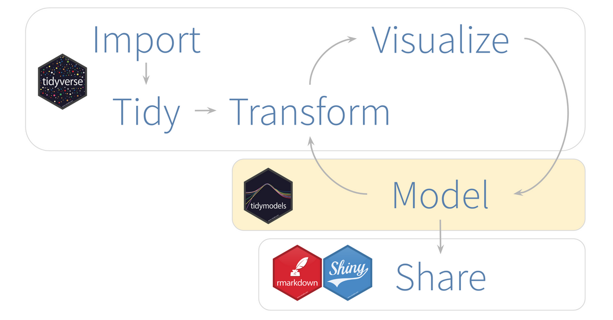
```

Source: [<span style="color: white; ">rviews</span>](https://rviews.rstudio.com/2019/06/19/a-gentle-intro-to-tidymodels/)


---

class: top, center

# Analyze Data

```{r, echo = FALSE, out.width = "800px", out.height= "450px", fig.align = "center"}
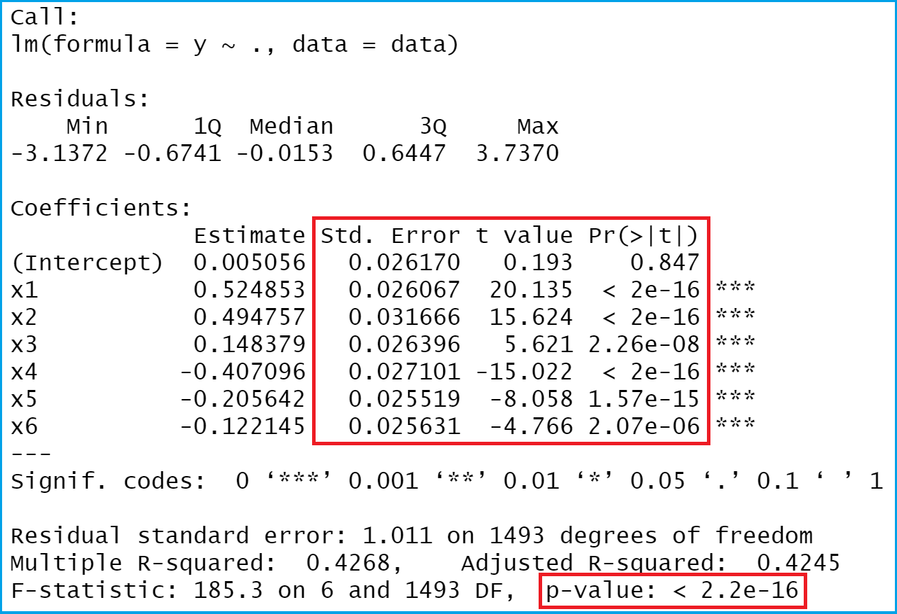
```

.footer[Source: [statisticsglobe](https://statisticsglobe.com/extract-standard-error-t-and-p-value-from-regression-in-r)]


---

class: top, center

# Data Visualization

```{r, echo = FALSE, out.width = "800px", out.height= "450px", fig.align = "center"}
knitr::include_graphics("img/graphs.jpg")
```

.footer[Source: @mohsinramay_]


---

class: top, center

# Mapping

```{r, echo = FALSE, out.width = "700px", out.height= "450px", fig.align = "center"}

```

.footer[Source: [revolutionanalytics](https://blog.revolutionanalytics.com/2012/02/creating-beautiful-maps-with-r.html)]


---

class: top, center

.left-column[
# Reporting
]

.right-column[
```{r, echo = FALSE, out.width = "550px", out.height= "600px"}
knitr::include_graphics("img/psc.gif")
```
]

.footer[Source: [RfortheRestofUs](https://rfortherestofus.com/consulting/)]


---

class: top, center

# Applications

```{r, echo = FALSE, out.width = "600px", out.height= "425px", fig.align = "center"}
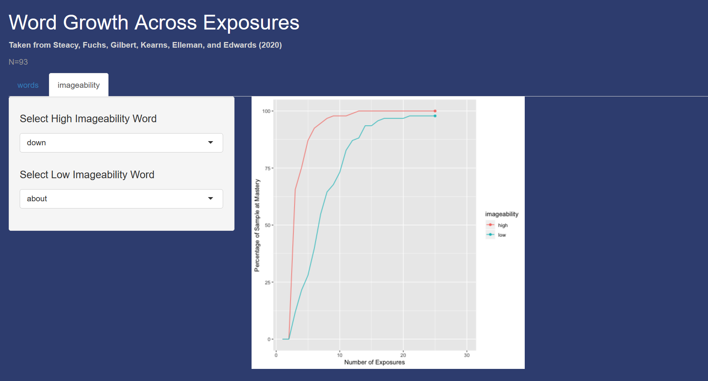
```

Source: [Ashley Edwards](https://wordreadinggrowth.shinyapps.io/exposures_to_mastery/)


---

class: top, center

# Slide Decks

```{r, echo = FALSE, out.width = "650px", out.height= "475px", fig.align = "center"}
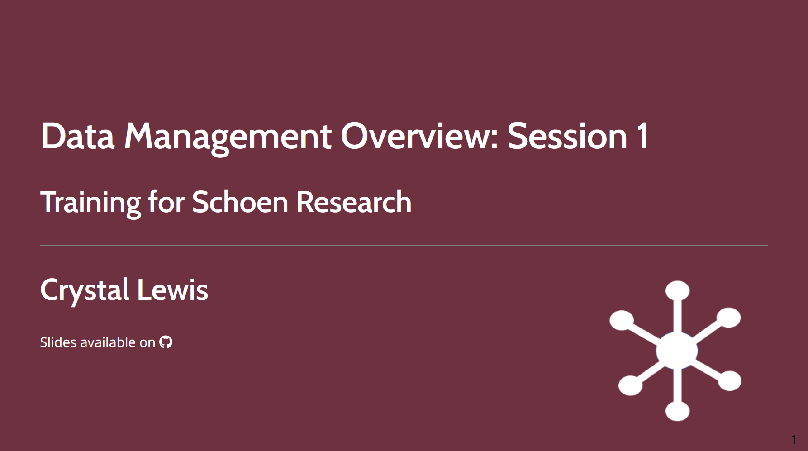
```

---

class: top, center

# Websites

```{r, echo = FALSE, out.width = "750px", out.height= "475px", fig.align = "center"}
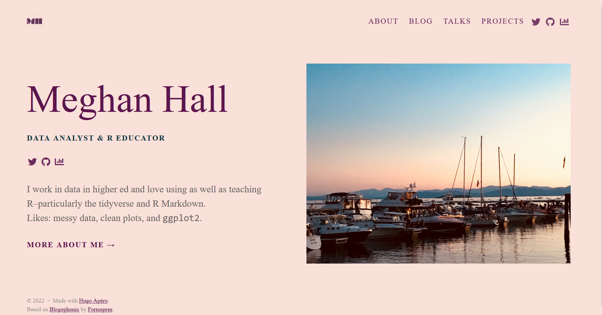
```

Source: [Meghan Hall](https://meghan.rbind.io/)

---

background-image: url(img/smiling_r_user.jpg)
background-size: contain

---

.pull-left[

```{r, echo = FALSE, out.width = "480px", out.height= "415px", fig.align = "center"}
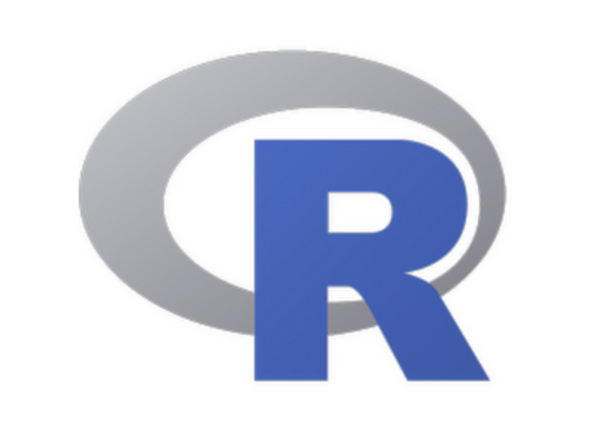
```

### R is a free, open-source programming language for statistics and data visualization
]

.pull-right[

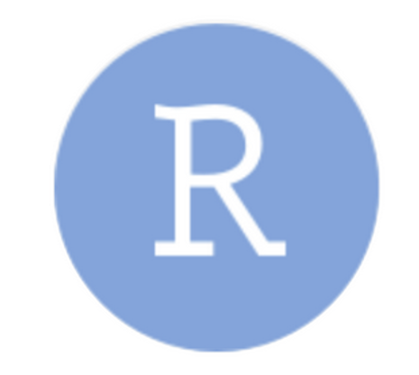

### RStudio is an integrated development environment (IDE) for R
]


---

background-image: url(img/dashboard.PNG)

.footnote[Source: [ModernDive](https://moderndive.com/1-getting-started.html#r-rstudio)]


---

.pull-left[

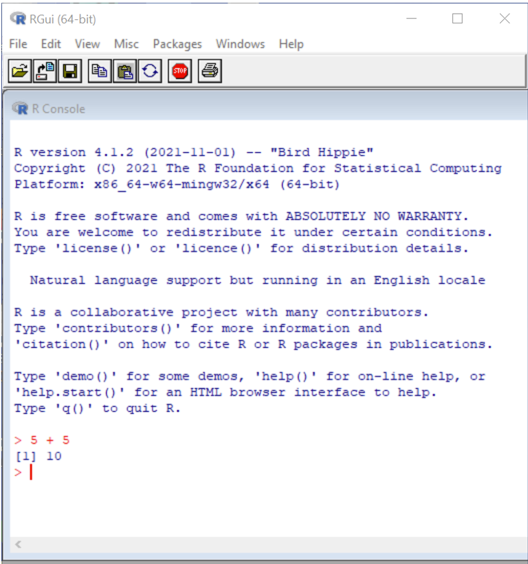
]

.pull-right[

```{r, echo = FALSE, out.width = "540px", out.height= "540px", fig.align = "center"}
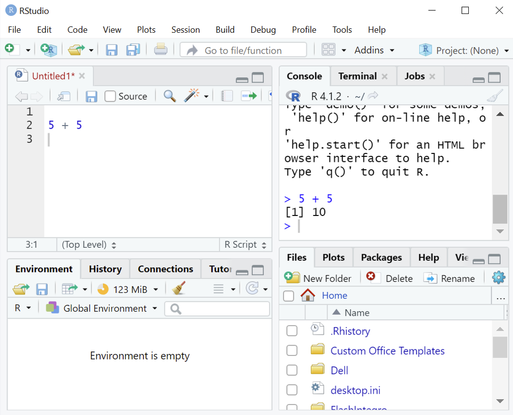
```
]


---

background-image: url(img/rstudio_types.PNG)
background-size: contain


---

background-image: url(img/cruella.gif)
background-size: contain


---

# Disclaimer

```{r, echo = FALSE, out.height = "500px", out.width = "900px", fig.align = "center"}
knitr::include_graphics("img/r_rollercoaster.png")
```

---

class: inverse

# Let's Get to Know R and RStudio

<style>

.exercise {

font-size: 2em;
font-style: bold

}
.tan{

color: #CEB888;

}
</style>

.exercise[`r fontawesome::fa("question", fill = "#CEB888")` .tan[Exercises] `r fontawesome::fa("question", fill = "#CEB888")`]

### 1. Open R

### 2. Open RStudio

### 3. Find what version of R and RStudio that you have


---

## Tour of RStudio

```{r, echo = FALSE, out.height= "500px", out.width = "800px", fig.align = "center"}
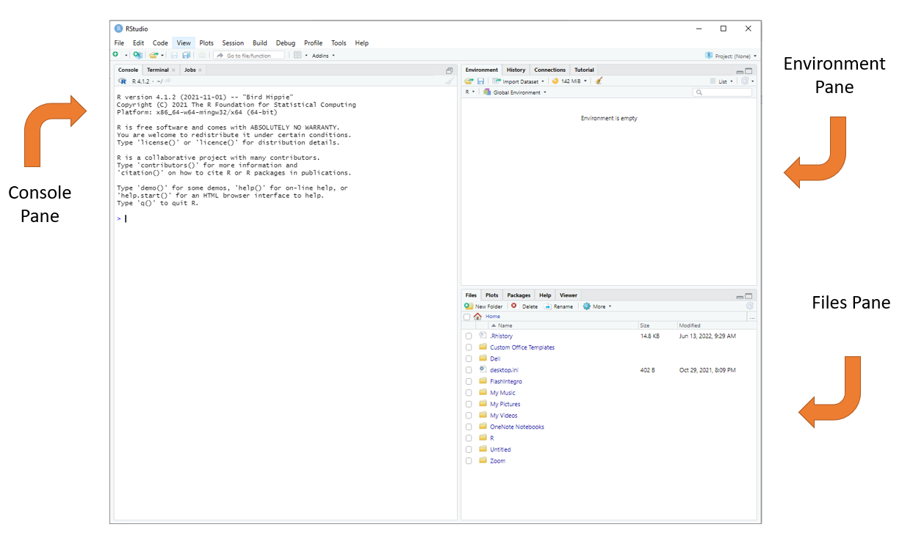
```


---

class: inverse
background-image: url(img/reminders.PNG)
background-size: 80%

---

## Source Pane

```{r, echo = FALSE, out.height= "500px", out.width = "800px", fig.align = "center"}
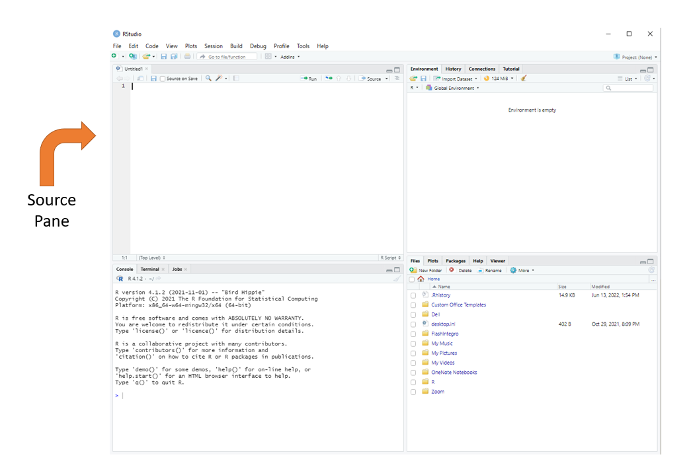
```


---

class: inverse
background-image: url(img/reminders2.PNG)
background-size: 80%

---

class: inverse

# Let's Get to Know our Settings

.pull-left[

.exercise[`r fontawesome::fa("question", fill = "#CEB888")` .tan[Exercises] `r fontawesome::fa("question", fill = "#CEB888")`]

### Tools -> Global Options

1. General Options

2. Code Options

3. Appearance Options

4. Pane Layout

]

.pull-right[


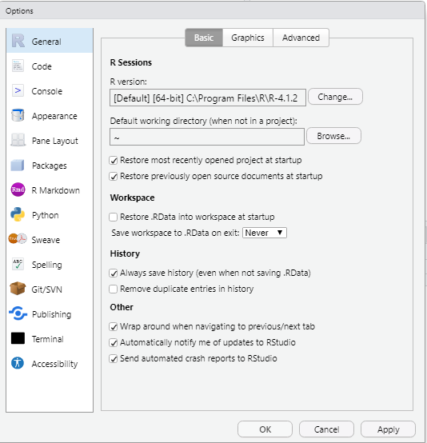
]


---

# Terminology

<style>

.yellow{

color: yellow;
font-style: bold;

}
</style>


Everything that exists in R is an **object**

Recall the assignment operator .yellow[`<-`]

```{r}

x <- 5

y <- 6

```

Everything that happens is a **function**

Consider the function .yellow[sum]

```{r}

sum(x, y)

```

.footnote[Source: [R for the Rest of Us](https://rfortherestofus.com/courses/getting-started/)]


---

# Objects

.pull-left[
1. There are 6 types of **objects** in R programming
  + **Vector**
  
  + Lists
  
  + Matrices
  
  + Array
  
  + Factors
  
  + **Data Frame** (Tibble)
  
]

.pull-right[

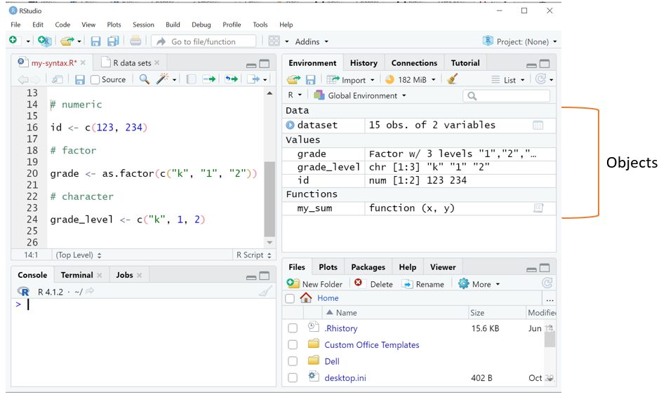
]


---

# Objects

.pull-left[
* Data Frame
  - Simply put, this is your dataset. A two dimensional data structure, where each column is a variable and each row is a case.
  - In R you can create your own dataframe or read in a dataframe from your computer, a website, or a package.
  - Tibble is another term you might hear
      
```{r}

data <- data.frame(
  id = c(123, 234, 456), 
                   age = c(12, 10, 9))

data

```
]

.pull-right[
* Vector
  - This is the simplest object
  - It consists of one or more elements all of the same type (ex: all numeric, all character)
  - Think of vector as a variable outside of a dataframe
  
```{r}

id <- c(123, 234, 456)

id

```
]


---

# Best Practices for Object Naming

.pull-left[

1. No spaces

2. Use all lower case

3. Use underscores to separate words

4. Descriptive

5. Not names of existing functions

6. Don't start with a number

7. No special characters

]

.pull-right[

```{r, eval = FALSE}

# Good
day_one
day_1

# Bad
1_day
DayOne
day-one
x

```

```{r}

# Bad
T <- FALSE
c <- 10
sum <- x + y

```

Source: [Advanced R](http://adv-r.had.co.nz/Style.html)

]


---

# Every R Object has a Type and Class

.pull-left[

#### **Type**: How an object is stored in memory

1. Character: **"apple"**, **"12_405"**

2. Double: **2**, **2.5**

3. Integer: **2L**

4. Logical: **TRUE**, **FALSE**

5. Complex: **1+4i**

]

.pull-right[

#### **Class**: The abstract type

1. Character

1. Numeric

1. Integer

1. Factor

1. Date

1. POSIXct

1. Logical


]

.footnote[[The Carpentries](https://swcarpentry.github.io/r-novice-inflammation/13-supp-data-structures/)]


---

# Examples of Type and Class

.pull-left[
```{r}

# Numeric vector

age <- c(12, 14)

class(age)

typeof(age)

```
]

.pull-right[

```{r}

# Date

birth_date <- as.Date(c("2005-01-14", 
                        "2006-07-22"))

class(birth_date)

typeof(birth_date)

```
]


---

# Examples of Type and Class

```{r}

# Dataframe

data <- data.frame(
  id = c(123, 234, 456), 
                   age = c(12, 10, 9))

print(data)

class(data)

typeof(data)

```

---

# Functions

.pull-left[

**Option 1:**

Write your own function

```{r}

my_sum <- function(x,y){
  x + y
}

my_sum(x=1, y=2)

```

]

.pull-right[

**Option 2:**

Use an existing function (calling a function)

```{r}

x <- 1
y <- 2

sum(x, y)

```
]


---

# Anatomy of a Function Call

<style>

.large {

font-size: 2em;
font-style: bold;

}

</style>

.center[.large[**function_name(arguments)**]]

.pull-left[
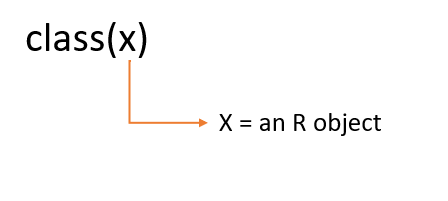
]

.pull-right[
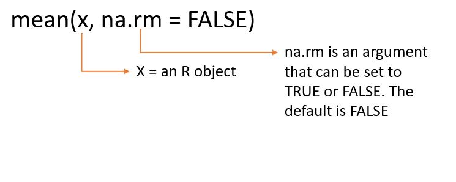
]


---

# `r fontawesome::fa("question", fill = "#782F40")` Let's Practice Some Base R Functions `r fontawesome::fa("question", fill = "#782F40")`

| Task  |  Function   | Arguments   |
|-------|------------|-------|
|combine elements |   `c` | objects |
|check the class of an object | `class` | object |
|check the length of a vector | `length` | object | 
|get the mean of values | `mean`  | object, na.rm|
|create a data frame | `data.frame` | vectors of the same length |
|check internal structure of an object | `str`| object |

<br>
<br>


---
class: inverse

# Packages

Packages are a collection of functions.

They are written by a worldwide community of R users and can be downloaded for free from the internet.

```{r, echo = FALSE, out.height = "300px", out.width = "600px", fig.align = "center"}
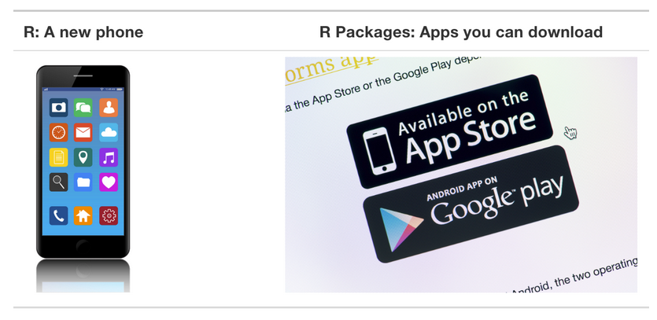
```

.footnote[Source: [<span style="color: white;">Modern Dive</span>](https://moderndive.com/1-getting-started.html#r-rstudio)]


---

# Packages

.pull-left[
#### A huge collection of packages are hosted on the internet
1. CRAN
  + A central repository supported by the R Foundation
  + **C**omprehensive **R** **A**rchive **N**etwork
  + These packages must meet certain quality standards, and are regularly tested
  + Anyone can submit their package to CRAN and have it published for broad use
  + https://cran.r-project.org/

#### You may also find packages in other places
2. Bioconductor
3. GitHub
4. Your own personal computer or network drive
]

.pull-right[
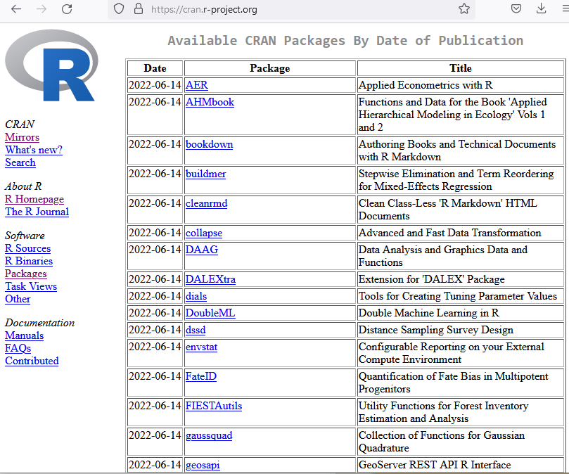
]

---

# How to Access Packages

.pull-left[
#### Step 1: Install: Do only once

Either install a package through code

```{r, eval = FALSE}

install.packages("package_name")

```

Or install manually

```{r, echo = FALSE, out.height = "275px", out.width = "600px"}
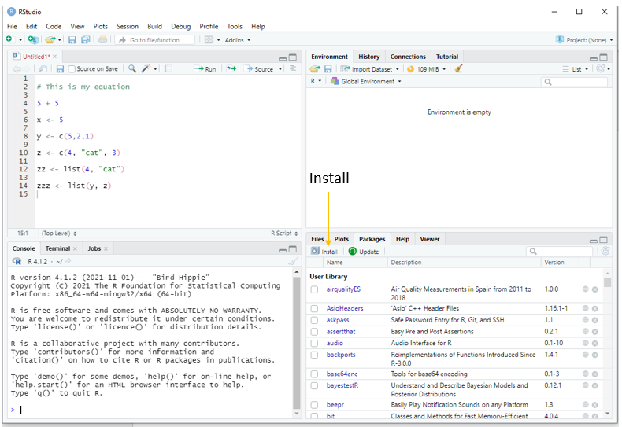
```

]

.pull-right[
#### Step 2: Load: Do every time you start R

```{r, eval = FALSE}

library(package_name)

library(stringr)
library(dplyr)
library(readr)
library(haven)

```
]


---

class: inverse

# Getting Help

If you want to understand a package, you have several options:

.pull-left[
Review the documentation.

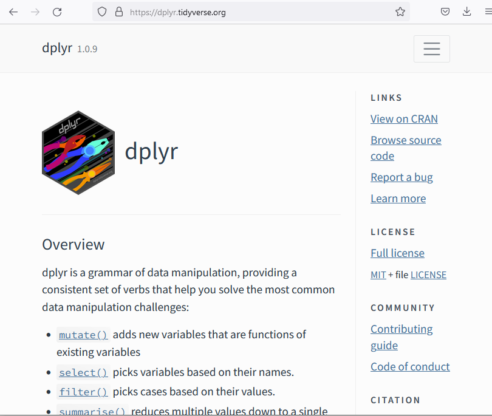
]

.pull-right[
Type .white[`?package_name`] in your console

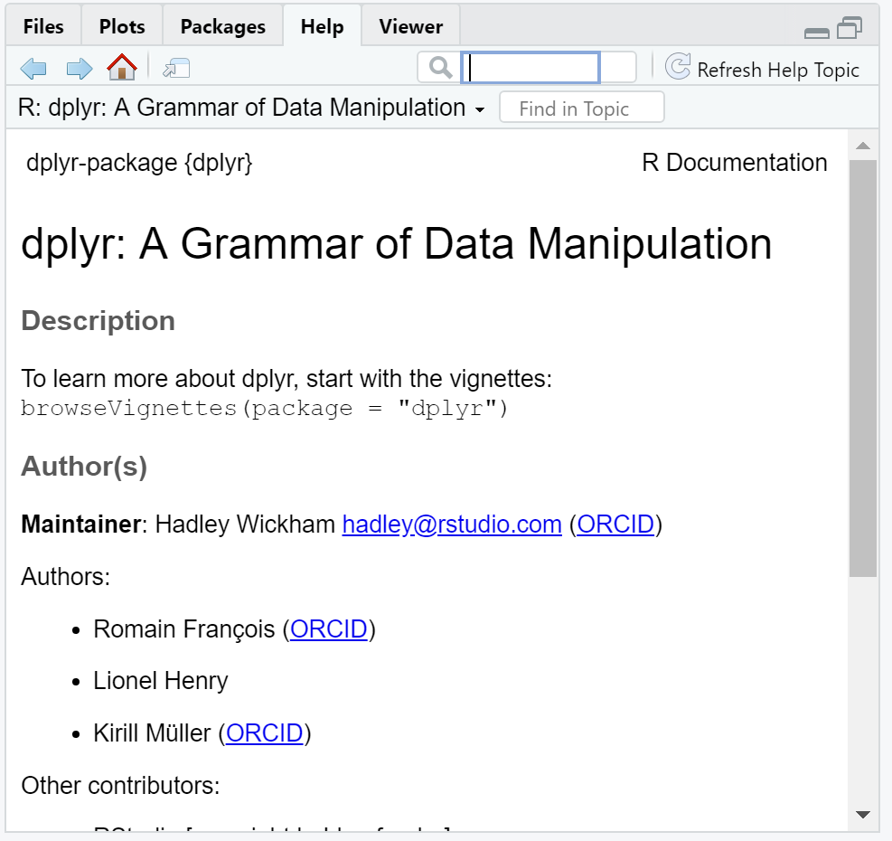

]


---

class: inverse

# Getting Help in General

.pull-left[

Google is your friend


]

.pull-right[

Turn to the supportive community

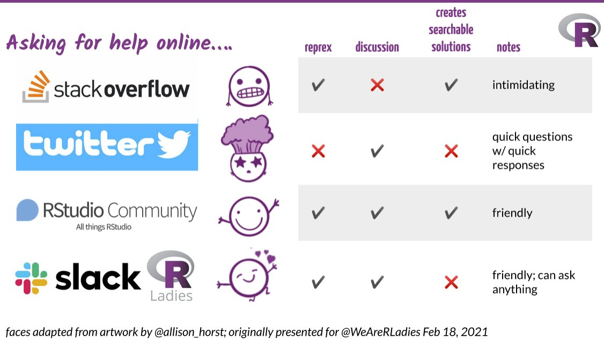

Source: [<span style="color: white;">Shannon Pileggi</span>](https://www.pipinghotdata.com/)

]


---

class: inverse

# Restart R Session

.pull-left[
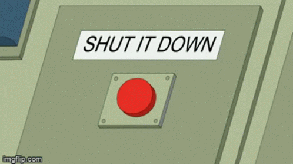
]

.pull-right[

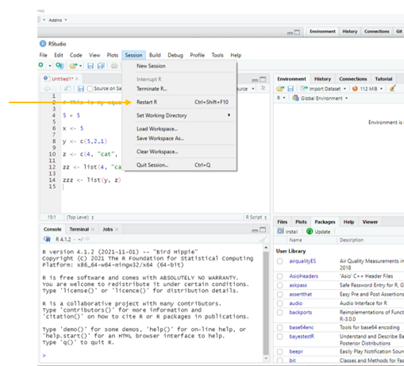
]


---

# `r fontawesome::fa("question", fill = "#782F40")` Let's Use our First Package `r fontawesome::fa("question", fill = "#782F40")`

.pull-left[
1. Open a script

2. Install a package
  + `readr`
  
3. Library a package
  + `library(readr)`
  
4. Use a function from that package
  + `read_csv()`
  + To read in this seattle pet names data from a website: https://raw.githubusercontent.com/rfordatascience/tidytuesday/master/data/2019/2019-03-26/seattle_pets.csv
]

.pull-right[

```{r, eval = FALSE}

# Install readr package

install.packages("readr")

# Library package

library(readr)

# Read in data using readr and assign to an object

pet_names <- read_csv("https://raw.githubusercontent.com/rfordatascience/tidytuesday/master/data/2019/2019-03-26/seattle_pets.csv")

```

]


---

# General Code Writing Best Practices


1. Comment your code
  + Comments begin with `#` and a space
  + Comments should explain what and why something is happening

```{r}

# Load raw data

# Drop duplicates cases from raw data

```

2\. Add sections to further refine your comments and make your file more searchable
  + Sections can be added by using 4 dashes after your comment `----`
  + You can also add sections by going to 
      - Code -> Insert Section

```{r}

# Load raw data ----

# (1) Read in the data

# (2) Review the data

```


---

# General Code Writing Best Practices

3\. Use spacing
  + Place spacing around all operators (**except** the colon)
  + Do not put spaces inside or outside parentheses for regular function calls

```{r, eval = FALSE}

# Good
average <- mean(feet / 12 + inches, na.rm = TRUE)
x <- 1:10
mean(x, na.rm = TRUE)

# Bad
average<-mean(feet/12+inches,na.rm=TRUE)
x <- 1 : 10
mean (x, na.rm = TRUE)
mean( x, na.rm = TRUE )

```

---

# General Code Writing Best Practices

4\. Function-indent long lines
  + Strive to limit your code to 80 characters per line 
  + If a function call is too long, place each argument on its own line
  
```{r, eval = FALSE}

do_something_very_complicated(
  something = "that",
  requires = many,
  arguments = "some of which may be long"
)

```

.footnote[Source: [Tidyverse Style Guide](https://style.tidyverse.org/syntax.html) and [Advanced R](http://adv-r.had.co.nz/Style.html)]


---

# Shortcuts

| Task  |  Windows   | Mac   |
|-------|------------|-------|
|Run current line of code | `Ctrl + Enter` |  `Cmd + Return` |
|Run all lines of code | ` Ctrl + A + Enter` | `Cmd + A + Enter` |
|Code completion | `Tab` | `Tab`|
|Insert assignment operator | `Alt + -` | `Option + -` |
|Insert pipe operator | `Ctrl + Shift + M` | `Cmd + Shift + M` |
|Comment or uncomment a line | `Ctrl + Shift + C` | `Cmd + Shift + C`|
|Restart R Session | `Ctrl + Shift + F10` | `Cmd + Shift + F10`
|Multi-line cursor| `Alt + click and drag` | `Option + click and drag`|
|Previous command in console | `up-arrow` | `up-arrow` |


---

# `r fontawesome::fa("question", fill = "#782F40")` Let's Practice Shortcuts `r fontawesome::fa("question", fill = "#782F40")`

```{r, echo = FALSE, out.height = "500px", out.width = "600px", fig.align='center'}
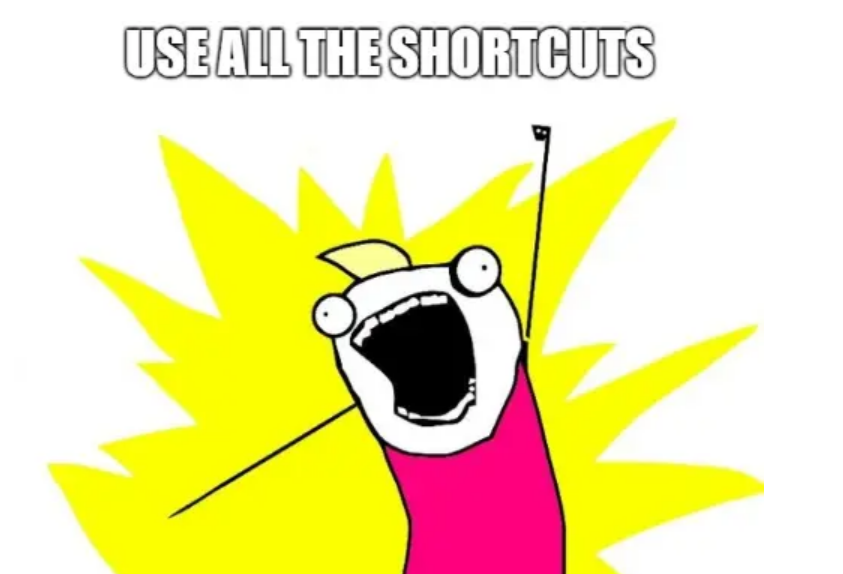
```

.footnote[Source: [Zenkit](https://zenkit.com/en/blog/shortcuts-for-all/)]

---

class: inverse, center, middle

# Questions?
