```{r setup, include=FALSE}
options(htmltools.dir.version = FALSE)
knitr::opts_chunk$set(
  fig.width=9, fig.height=3.5, fig.retina=3,
  out.width = "100%",
  cache = FALSE,
  echo = TRUE,
  message = FALSE, 
  warning = FALSE,
  hiline = TRUE,
  comment = NA
)

xaringanExtra::use_tile_view()
xaringanExtra::use_panelset()

```


```{r xaringan-themer, include=FALSE, warning=FALSE}

library(xaringanthemer)

style_duo_accent(
  secondary_color = "#782F40",
  primary_color = "black", 
  background_color = "#CEB888",
  code_inline_color = "black",
)
```


class: inverse, left, middle

background-image: url(img/cover2.png)

# Data Management Overview: Session 4
## Training for Schoen Research

----

## Crystal Lewis

Slides available on [`r fontawesome::fa("github", fill = "white")`](https://cghlewis.github.io/schoen-data-mgmt-series-public/)

---

# Plan for this series

.pull-left[

Session 3
* ~~Why R?~~
* ~~Getting acclimated with R and RStudio~~
* ~~Understanding objects, functions, and packages~~
* ~~Code writing best practices~~

Session 4
* Packages and functions for data wrangling
]

.pull-right[

Session 5
* Setting up a reproducible syntax file
* Cleaning and validating data with R

Session 6
* Additional data wrangling with R

```{r, echo = FALSE, out.width = "300px", fig.align='center'}
knitr::include_graphics("img/r-project.svg")
```
]


---

class: inverse, center, middle

# Recap


---

background-image: url(img/where_to_code.PNG)


---

.pull-left[

## Not assigned to an object

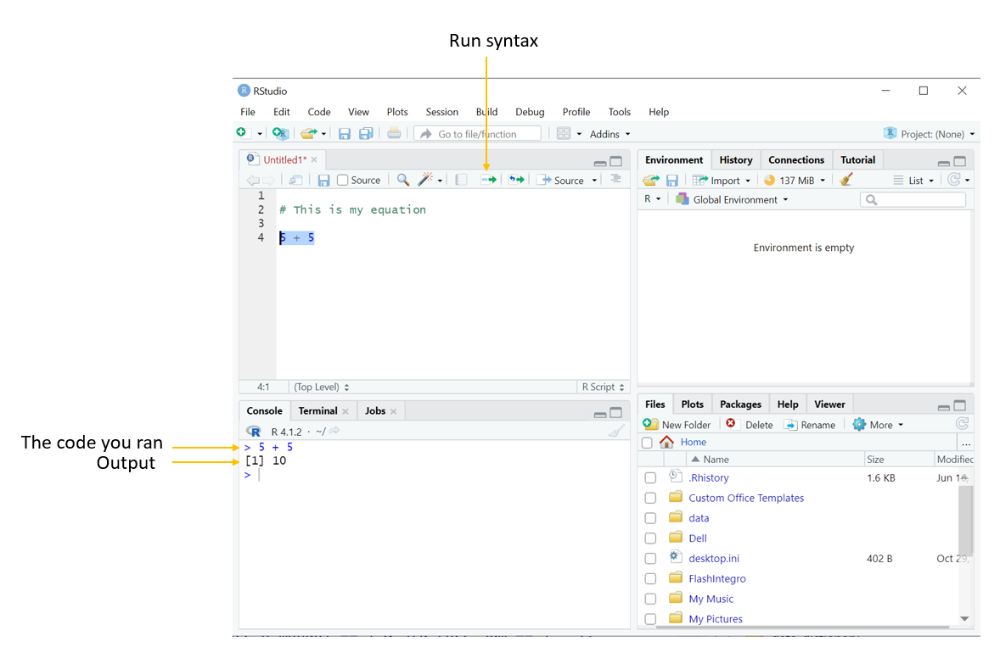
]

.pull-right[

## Assigned to an object

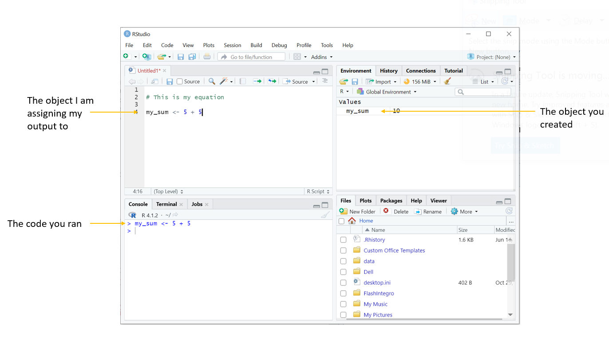
]


---

# Recap Objects

.pull-left[Everything that exists in R is an **object**]

.pull-right[We create objects in R by using the **<-**]

.pull-left[
* Data Frame/Tibble
      
```{r}

data <- data.frame(
  id = c(123, 234, 456), 
                   age = c(12, 10, 9))

data

```
]

.pull-right[
* Vector
  
```{r}

test_score <- c(10, 20, 15)

test_score

x <- 5

x

```
]


---

# Object Type and Class

.pull-left[

1. **Type**: How an object is stored in memory
2. **Class**: The abstract type
  * Character
  * Numeric
  * Integer
  * Factor
  * Date
  * POSIXct
  * Logical

]

.pull-right[

#### As a user, we care about **CLASS**

1. Certain functions require objects to be of a particular class
  * Ex: The `mean()` function requires an R object that is numeric, logical or date. It cannot work with an object that is character.
2. Class is how we see and interact with the object

]

.pull-left[

```{r}
birth_date <- as.Date(c("2005-01-14", 
                        "2006-07-22"))

typeof(birth_date)

```
]

.pull-right[

```{r}

class(birth_date)
```


]


---

# Recap Functions

.pull-left[

Everything that happens is a **function**

Anatomy of a function: **function_name(arguments)**

Typically your first argument is to declare an **object**
  - There may be additional arguments that take statements like TRUE or FALSE or a number

Type`?functionname` in console to learn more about a function

]

.pull-right[

Ex: `head(x = object, n = integer)`

```{r, echo = FALSE}

data <- data.frame(
  id = c(123, 234, 456), 
                   age = c(12, 10, 9))

```

```{r}

head(x = data, head = 3L)

```


]


---


# Recap Functions

.pull-left[

`c(objects)`
```{r}

# create numeric vector
test_score <- c(20, 30, 40, NA)

#create numeric vector
id <- c(10, 11, 12, 13)

# create character vector
fav_color <- c("green", "black", 
               "blue", "violet")

# create character vector
grade_level <- c("k", 1, 2, 1)

```

]

.pull-right[

`class(object)`  
`length(object)`  
`mean(object, na.rm = FALSE)`
```{r, eval = FALSE}

# check class of test_score
class(test_score)

# check length of test_score
length(test_score)

# get mean of test_score, remove NA values
mean(test_score, na.rm = TRUE)

```

]


---

# Recap Functions

.pull-left[
```{r}

id

grade_level

test_score

fav_color


```
]

.pull-right[
```{r}

# create a data frame
sch_data <- data.frame(id, grade_level, 
                       test_score, fav_color)

```

```{r, echo = FALSE}

print(sch_data)

```

```{r, highlight.output=c(1)}

str(sch_data)
```
]

---

class: inverse

.left-column[
# Recap Packages
]

.right-column[
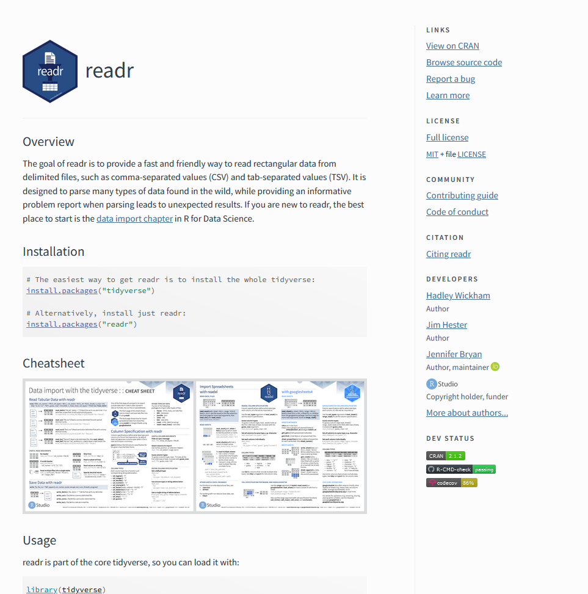
]


---

class: inverse

.left-column[
# Recap Packages
]

.right-column[
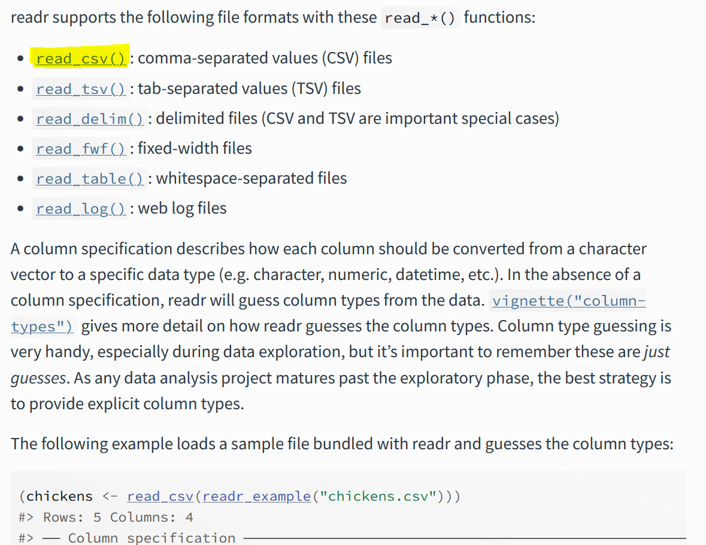
]


---

class: inverse

.pull-left[


```{r, echo = FALSE, out.height = "500px", out.width = "650px"}
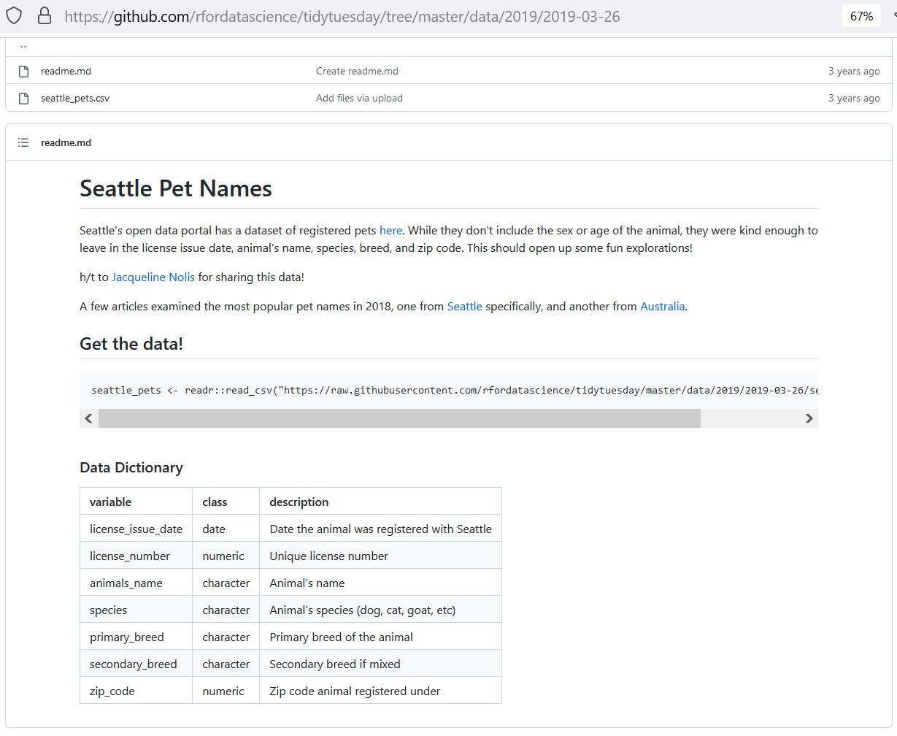
```
]

.pull-right[

```{r, echo = FALSE, out.height = "500px", out.width = "650px"}
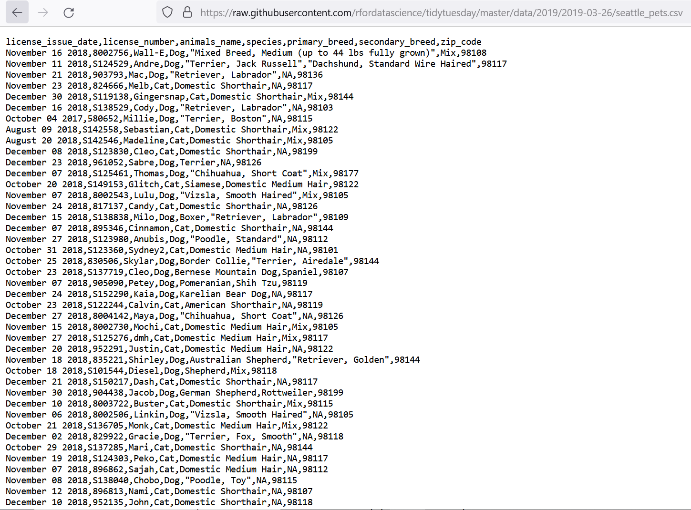
```
]


---

class: inverse

.pull-left[
```{r, eval = FALSE}

# Install readr package
# Never do this again

install.packages("readr")

# Library package

library(readr)

# Read in data using readr and 
# assign to an object

pet_names <- read_csv(
  "https://raw.githubusercontent.com/
  rfordatascience/tidytuesday/master/
  data/2019/2019-03-26/seattle_pets.csv")


```
]

.pull-right[
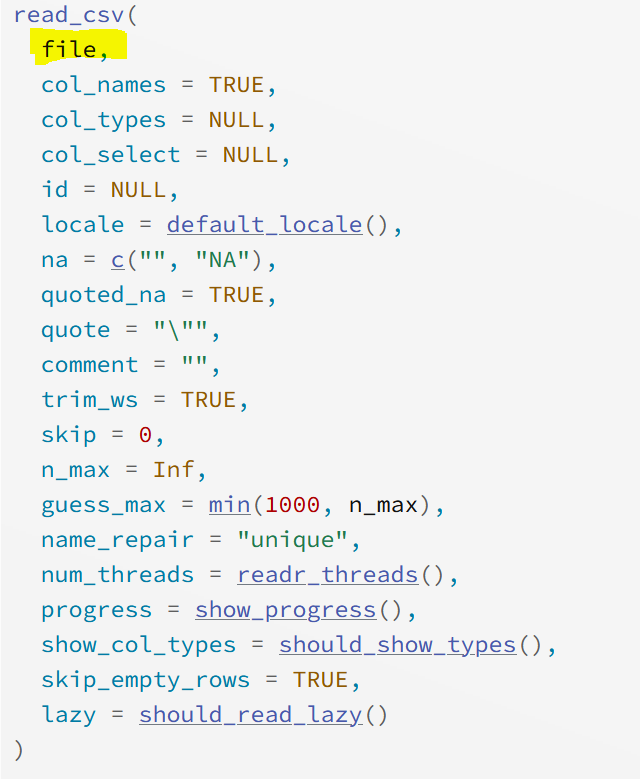

]


---

background-image: url(img/pet_names.PNG)

class: inverse


---

# Recap Packages

```{r, echo = FALSE}

# Library package

library(readr)

# Read in data using readr and assign to an object

pet_names <- read_csv("https://raw.githubusercontent.com/rfordatascience/tidytuesday/master/data/2019/2019-03-26/seattle_pets.csv")

```

```{r}

names(pet_names)

```

```{r, highlight.output=c(10)}

head(pet_names)

```


---

# Recap Packages

```{r, highlight.output=c(1)}

str(pet_names)

```


---

# Recap Packages

```{r, highlight.output=c(1, 3)}

print(pet_names)

```


---

# Recap Packages

```{r, eval = FALSE}

View(pet_names)

```

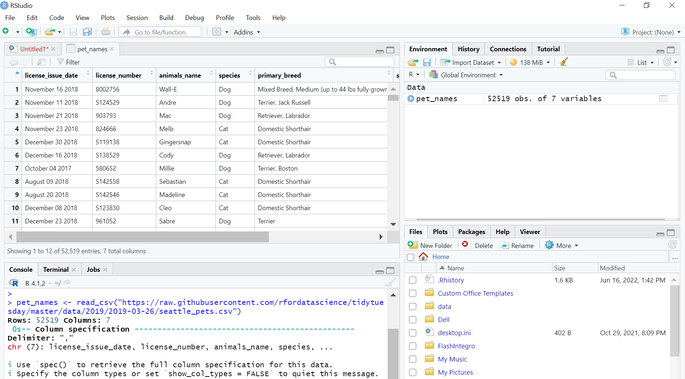


---

class: middle, center
background-image: url(img/packages2.jpg)
background-size: cover

# .white[Packages]


---

class: center

# Tidyverse


**An opinionated collection of R packages designed for data science**

**All packages share an underlying design philosophy, grammar, and data structures**

  

.left[.footnote[Source: [Tidyverse packages](https://www.tidyverse.org/packages/)]]


---

# Benefits to Tidyverse

.pull-left[

1. <span style = 'font-size: 150%;'>`r fontawesome::fa("check", fill = "#782F40")`</span> Consistency

2. <span style = 'font-size: 150%;'>`r fontawesome::fa("question", fill = "#782F40")`</span> Intuitive

3. <span style = 'font-size: 150%;'>`r fontawesome::fa("file", fill = "#782F40")`</span> Great documentation!

4. <span style = 'font-size: 150%;'>`r fontawesome::fa("support", fill = "#782F40")`</span> Great, supportive community!

5. <span style = 'font-size: 150%;'>`r fontawesome::fa("circle-o-notch", fill = "#782F40")`</span> It has an entire ecosystem

]

.pull-right[

```{r fig.align="center", echo=FALSE, out.width='650px', out.height = '400px'}

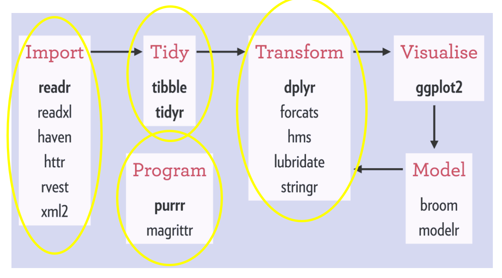
```
]

.footnote[Source: [rviews](https://rviews.rstudio.com/2017/06/08/what-is-the-tidyverse/)]


---

# Tidy Evaluation

.center[
If a vector/variable exists within a data frame (or tibble) there are two ways **base R** gives you to work with that variable

```{r, echo = FALSE}

library(tidyverse)

sch_data <- tibble::tribble( ~id, ~test_score, ~grade_level,
                             123, 350, 3,
                             234, 380, 4,
                             345, 290, 3)

sch_data

```
]

.pull-left[

1. Standard Evaluation

```{r}

sch_data[["test_score"]]

```


```{r, eval = FALSE}

sch_data[ , 2]

```


```{r, eval = FALSE}

sch_data[ , "test_score"]

```


]

.pull-right[

2\. Non-standard Evaluation

```{r}

sch_data$test_score

```
]


---

# Tidy Evaluation

.center[In comes, a 3rd option, **tidy evaluation**.]

.center[Tidy evaluation is a special type of non-standard evaluation used throughout the tidyverse.]

.pull-left[

3\. Tidy Evaluation - Data Masking & Tidy Selection

```{r}

select(sch_data, test_score, grade_level)

```
]

.pull-right[
Compare this to base R

```{r}

sch_data[ , c("test_score", "grade_level")]

```
]


---

# Tidy Evaluation

.center[Filter our dataset to cases where **test_score** is greater than 300 and **grade_level** is 3]

.pull-left[
Tidy Evaluation

```{r}

filter(sch_data, test_score > 300 
       & grade_level == 3)

```
]

.pull-right[

Base R

```{r}

sch_data[sch_data$test_score > 300 
         & sch_data$grade_level == 3, ]

```
]


---

# The Pipe Operator


.pull-left[


]

.pull-right[

Without the pipe
```{r, eval = FALSE}

sch_data <- read_csv("school_data.csv")

sch_data2 <- select(sch_data, id, test_score)

sch_data3 <- filter(sch_data2, 
                    test_score > 300)

```

With the pipe

```{r, eval = FALSE}

sch_data <- read_csv("school_data.csv") %>%
  select(id, test_score) %>%
  filter(test_score > 300)

```


]

.footnote[Source: [magrittr package](https://magrittr.tidyverse.org/)]


---

# The Pipe Operator

.pull-left[
```{r, eval = FALSE}

data_frame %>%
  function1 %>%
  function2 %>%
  function3 %>%

```
]

.pull-right[

```{r, eval = FALSE}

use_this_data %>%
  then_do_this %>%
  then_do_something_else %>%
  then_do_another_thing

```

]

.center[
Objects you create in a step, can be used in later steps
```{r}

sch_data %>%
  mutate(new_test_score = test_score + 200) %>%
  filter(new_test_score > 500)

```
]

-----

<style>

.purple{

color: purple;

}
</style>

.center[.purple[SIDE NOTE: There is a new native pipe operator that looks like this `**|>**`]]


---

class: inverse, middle, center

# Data Cleaning Functions


---


# Files for Today

.left-column[
In our practice folder we have:

1. .R "install packages" syntax file
1. 4 .R "example functions" syntax files with pre-filled code
1. data dictionary
1. .csv data file
1. .xlsx data file
1. .sav data file

]

.right-column[

Data Files are 5 x 6

```{r, echo = FALSE, message = FALSE, warning = FALSE}

library(readxl)
library(fs)
library(here)
library(kableExtra)

# data <- read_excel(path = path(".", "data", "tch_survey.xlsx"))

# data <- read_excel(path = here("rslides", "data", "tch_survey.xlsx"))

# data <- tibble::tribble (~`Start Date`, ~ ResponseId, ~id, ~consent, ~dist_sch_name, ~role, ~degree, ~`yrs teach middle`, ~ # `yrs teach high`, ~tch_tools,
#                          "2022-05-15", "x004", 1234, 1, "Kirkwood - Tillman Elementary", 1, 3, 4, "5 yrs", "Zoom",
#                          "2022-05-15", "x005", 1234, NA, "", NA, NA, NA, "", "",
#                          "2022-05-16", "x006", 1235, 1, "Webster - Webster Groves High School", 1, 2, 0, "4", "Google meet, # zoom",
#                          "2022-05-17", "x007", 1236, 1, "Kirkwood - Nipher Middle", 3, 5, 2, "1 year", "google met",
#                          "2022-05-17", "x007", 1237, 2, "", NA, NA, NA, "", "")

svy <- tibble::tribble (~`SurveyDate`, ~id, ~consent, ~dist_sch_name, ~degree,~ `yrs teach`,
                         "2022-05-15", 1234, 1, "Kirkwood - Nipher Middle School", 1, "5 yrs",
                         "2022-05-15", 1234, NA,"", NA, "",
                         "2022-05-16", 1235, 1, "Webster - Webster Groves High School", 2, "4",
                         "2022-05-17", 1236, 1, "Kirkwood - Nipher Middle", 6, "1 year",
                         "2022-05-17", 1237, 2, "" , NA, "")

kable(svy, format = "html") %>%
  kable_styling("striped", full_width=T)


```
]


---

class: center, inverse

# Data Dictionary


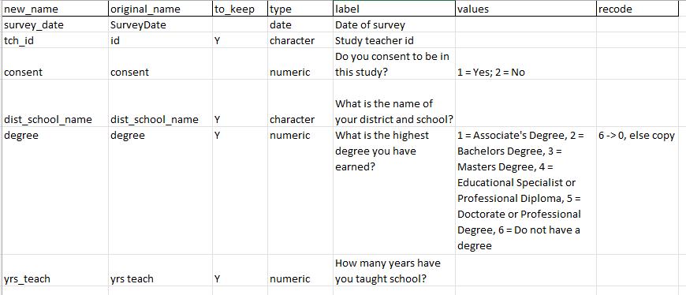


---

# Functions for Data Cleaning

.pull-left[

**Read in data**

|Task | Package | Function |
|-----|---------|----------|
|read in csv file | readr | read_csv |
|read in xlsx file | readxl | read_excel |
|read in sav file | haven | read_sav |

**Set relative path**

|Task | Package | Function |
|-----|---------|----------|
|check working directory | base | getwd |
|set relative path | here | here |
|set relative path | fs | path |

]

.pull-right[

**Rename variables**

|Task | Package | Function |
|---------|-----------|-----------|
|rename variables | dplyr | rename |
|rename all variables | purrr | set_names|
|modify variable names | dplyr | rename_with |

**Review data**

|Task | Package | Function |
|-----|---------|----------|
|review data structure | base |str|
|transposed printed data | dplyr | glimpse |
|summarize data | base | summary |
|table variables | janitor | tabyl|

]


---

# Read in Data

.panelset[
.panel[.panel-name[read_csv]

```{r, eval = FALSE}

read_csv(file = "file_name.csv", skip = 1, col_names = TRUE, na = "-99")

```

* file = file name (including path if necessary) as a string

* skip = Number of lines to skip before reading in data

* col_names = Either TRUE or FALSE, if TRUE the first row of the input will be used as column names. If FALSE, column names will be generated automatically: X1, X2, X3, etc.

* na = Character vector of strings to interpret as missing values

]

.panel[.panel-name[read_excel]

```{r, eval = FALSE}

read_excel(path = "file_name.xlsx", sheet = "Sheet 1", 
                   skip = 1, col_names = TRUE, na = "-99")

```

* path = file name (including path if necessary) as a string

* sheet = Sheet to read. Either a string (name of sheet), or an integer (position of sheet).

* skip = Minimum number of rows to skip before reading anything

* col_names = Either TRUE or FALSE, TRUE to use the first row as column names, FALSE to get default names

* na = Character vector of strings to interpret as missing values. By default readxl treats blanks cells as missing.

]

.panel[.panel-name[read_sav]

```{r, eval = FALSE}

read_sav(file = "file_name.sav", skip = 1, user_na = TRUE)

```

* file = file name (including path if necessary) as a string

* skip = Number of lines to skip before reading data

* user_na = Either TRUE or FALSE, if TRUE variables with user defined missing values will be read in as labelled objects. If FALSE, user-defined missing values will be converted to NA.

]
]


---

# Create Absolute Paths

.pull-left[
When you open your syntax file to read in your data, if your working directory is not set to where your data file is, you will need to designate a path for your computer to find your data file.

You can find your working directory by typing `getwd()` in your console

```{r, eval = FALSE}

getwd()

```

```{r, eval = FALSE}

"C:/Users/Crystal/Desktop/
schoen_example_files"

```

]

.pull-right[

In R, paths should be created with "/"
  - Note this is different than the "\" that Windows uses

For example, an absolute path to my `tch_survey.csv` file:

Windows: 
"C:\Users\Crystal\Desktop\schoen_example_files\
data\tch_survey.csv"

R: 
"C:/Users/Crystal/Desktop/schoen_example_files/
data/tch_survey.csv"

R: 
"C:\\\Users\\\Crystal\\\Desktop\\\schoen_example_files\\\
data\\\tch_survey.csv"
]

---

# Create Relative Paths

The problems with absolute paths include:

1. If you share files, other users will not have the same directory structure as you, so they will need to recreate the file path
2. If you alter your directory structure, you will need to rewrite your paths
3. If you copy and paste file paths from Windows, you will need to fix all of your backslashes
  - Some paths can be very long and this leaves a lot of room for error

.center[In come "**relative paths**"]

.pull-left[

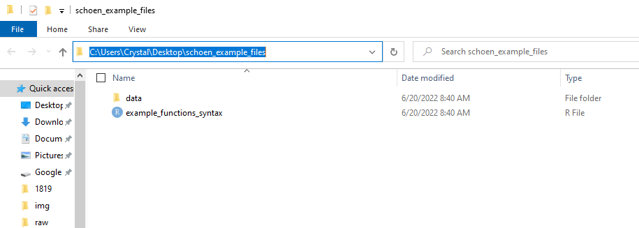
]

.pull-right[

"C:/Users/Crystal/Desktop/schoen_example_files"

My relative path starts at the top of this working directory (or the root directory)

`"./data/tch_survey.csv"`

]

Source: [ExcelQuick](https://excelquick.com/r-programming/importing-data-absolute-and-relative-file-paths-in-r/)


---

# Relative Paths

.panelset[
.panel[.panel-name[here]

```{r, eval = FALSE}

here()

read_csv(file = here("data", "tch_survey.csv"))

```

`"C:/Users/Crystal/Desktop/schoen_example_files"`

<br>

If your file is outside of your working directory, you can navigate up using `..`
  * Ex: My data file is in "C:/Users/Crystal/Desktop/other_project/tch_survey.csv"

I can go up one folder to the "Desktop" folder and then build my path from there

```{r, eval = FALSE}

read_csv(file = here("..", "other_project", "tch_survey.csv"))

```


]

.panel[.panel-name[path]

```{r, eval = FALSE}

path_wd()

read_csv(file = path(".", "data", "tch_survey.csv"))

```

`"C:/Users/Crystal/Desktop/schoen_example_files"`

<br>

If your file is outside of your working directory, you can navigate up using `..`
  * Ex: My data file is in "C:/Users/Crystal/Desktop/other_project/tch_survey.csv"

I can go up one folder to the "Desktop" folder and then build my path from there

```{r, eval = FALSE}

read_csv(file = path("..", "other_project", "tch_survey.csv"))

```

]
]


---

# Name variables

.panelset[
.panel[.panel-name[rename]

Formula is `new name = old name`

```{r, eval = FALSE}

data %>%
  rename(new_name = old_name)

```

If the old name has spaces in it, you need to surround the name in backticks ` `

```{r, eval = FALSE}

data %>%
  rename(tch_gender = x1, tch_race = `teacher race`)

```


]

.panel[.panel-name[set_names]


The number of names must equal the number of variables in the data frame, in the same order

Names must be in ""

```{r, eval = FALSE}

data %>%
  set_names("new_name1", "new_name2", "new_name3")


```
]

.panel[.panel-name[rename_with]

.pull-left[

```{r, eval = FALSE}

data %>% 
  rename_with(~ function, variables)

```

* `~` = as a function of

* function = any function you want to use to rename your variables

* variables = any variables you want to rename with your function

]

.pull-right[
A common function to include is `paste0` which is a base function

This transformation below would add `_1819` to the end of variable names

The `.` means paste my variable name **first**, then add my string.

```{r, eval = FALSE}

data %>% 
  rename_with(~ paste0(., "_1819"), 
              c(variable1, variable2))

```

]
]
]


---

# Review Data

Data

.panelset[
.panel[.panel-name[str]

```{r, eval = FALSE}

data %>%
  str()

```

```{r, echo = FALSE}

svy %>%
  purrr::set_names("start_date", "tch_id", "consent", "dist_sch_name", "degree", "yrs_teach") %>%
  str()

```

]
.panel[.panel-name[glimpse]

```{r, eval = FALSE}

data %>%
  glimpse()

```

```{r, echo = FALSE}

svy %>%
  purrr::set_names("start_date", "tch_id", "consent", "dist_sch_name", "degree", "yrs_teach") %>%
  glimpse()

```

]

.panel[.panel-name[summary]

.pull-left[
```{r, eval = FALSE}

data %>%
  summary()

```
]

.pull-right[
```{r, echo = FALSE}

svy %>%
  purrr::set_names("start_date", "tch_id", "consent", "dist_sch_name", "degree", "yrs_teach") %>%
  summary()

```

]
]

.panel[.panel-name[tabyl]

.pull-left[
```{r, eval = FALSE}

data %>%
  tabyl(variable name)

```

```{r, echo = FALSE}

svy %>%
  purrr::set_names("start_date", "tch_id", "consent", "dist_sch_name", "degree", "yrs_teach") %>%
  janitor::tabyl(degree)

```

]

.pull-right[

```{r, eval = FALSE}

data %>%
  tabyl(variable1, variable2)

```

```{r, echo = FALSE}

svy %>%
  purrr::set_names("start_date", "tch_id", "consent", "dist_sch_name", "degree", "yrs_teach") %>%
  janitor::tabyl(dist_sch_name, degree)

```

]
]
]

---

class: center, middle

# `r fontawesome::fa("question", fill = "#782F40")` Let's Practice `r fontawesome::fa("question", fill = "#782F40")`

---

# Functions for Data Cleaning

.pull-left[

**Find and remove duplicates**

|Task | Package | Function |
|-----|---------|----------|
|find duplicates| janitor | get_dupes |
|remove duplicates | dplyr | distinct |

**Filter data**

|Task | Package | Function |
|-----|---------|----------|
|filter rows of data | dplyr | filter |

]

.pull-right[

**Select variables**

|Task | Package | Function |
|-----|---------|----------|
|select variables | dplyr | select |

**Create new variables**

|Task | Package | Function |
|-----|---------|----------|
|create new variable|dplyr | mutate|
]


---

# Remove duplicates

.panelset[
.panel[.panel-name[find-duplicates]

An example identifier variable would be a student or teacher id

```{r, eval = FALSE}

data %>%
  get_dupes(identifier variable/s)

```

```{r, echo = FALSE}

svy %>%
  purrr::set_names("start_date", "tch_id", "consent", "dist_sch_name", "degree", "yrs_teach") %>%
  janitor::get_dupes(tch_id)

```

]

.panel[.panel-name[remove-duplicates]

.pull-left[

```{r, eval = FALSE}

data %>%
  distinct(identifier variable/s, 
           .keep_all = TRUE)

```

* .keep_all = TRUE means that I want to keep all of my variables in the data

Using distinct will keep the first instance and drop all remaining duplicates. 

Depending on how your data is organized, this may not be what you want.
]

.pull-right[

Consider using the `arrange` function from the `dplyr` package to arrange the data how you want before dropping the duplicates

For example, if date was collected, you may want to arrange by descending date to keep the most recent case 

```{r, eval = FALSE}

data %>%
  arrange(tch_id, desc(date)) %>%
  distinct(tch_id, .keep_all = TRUE)

```
]
]
]


---

# Filter data

.panelset[
.panel[.panel-name[filter-operators]

.pull-left[
Filtering/Comparison operators include 
 - `>`
 - `<`
 - `>=`
 - `<=`
 - `==`
 - `!` or `!=`
 - `%in%`
 - `between`
]

.pull-right[
Logical operators used to filter on multiple columns:

|Operator|Meaning          |
|--------|-----------------|
| &#124;   | AND/OR          |
|  &     | AND             |
| ,      | AND             |
| xor    | OR (not both)   |
]
]

.panel[.panel-name[filter-numeric]

.pull-left[


```{r, eval = FALSE}

data %>%
  filter(logical expression)

```
]

.pull-right[
Here you would use a variable in your data and a comparison operator

```{r, eval = FALSE}

data %>%
  filter(numeric variable == 1)

```

```{r, eval = FALSE}

data %>%
  filter(numeric variable >= 50)

```
]

]

.panel[.panel-name[filter-character]

.pull-left[
I can also filter on non-numeric variables

```{r, eval = FALSE}

data %>%
  filter(logical expression)

```
]

.pull-right[

```{r, eval = FALSE}

data %>%
  filter(character variable == "some string")

```

```{r, eval = FALSE}

data %>%
  filter(character variable %in% 
           c("some string", 
             "some other string"))

```

]
]

.panel[.panel-name[filter-na]

I can filter based on NA values

The function `is.na` is a base function that returns either TRUE or FALSE which the filter function uses to determine who to filter on

```{r, eval = FALSE}

data %>%
  filter(!is.na(variable))

```

]

.panel[.panel-name[filter-multiple-vars]

I can also filter using multiple variables

```{r, eval = FALSE}

data %>%
  filter(variable1 == 1 & variable2 == 5)

```

```{r, eval = FALSE}

data %>%
  filter(variable1 == "some text" | variable2 == "other text")

```

]
]


---

# Select Variables

.panelset[
.panel[.panel-name[select-to-keep]

You can either select the variables you want to keep 

```{r, eval = FALSE}

data %>%
  select(variable1:variable3)

```

```{r, eval = FALSE}

data %>%
select(variable1, variable2, variable3)

```


]

.panel[.panel-name[select-to-remove]

Or select the variables you want to remove (using "-")

```{r, eval = FALSE}

data %>%
  select(-variable4)

```

```{r, eval = FALSE}

data %>%
  select(-c(variable4, variable5, variable6))

```

]

.panel[.panel-name[select-with-tidy-select]

You can also select variables using selection helpers.

These include: `starts_with`, `ends_with`, and `contains`.

```{r, eval = FALSE}

data %>%
  select(contains("bmtl"))

```

```{r, eval = FALSE}

data %>%
  select(ends_with("_1819"))

```

]
]


---

# Create new variables

.pull-left[

Any time you want to create a new variable within a data frame, you use `mutate`

This may be creating an entirely new variable or it may be recalculating, transforming, or recoding an existing variable

```{r, eval = FALSE}

data %>%
  mutate(new variable name = 
           a constant or some expression)

```

* `new variable name` = this can either be a completely new name, or you can use an existing name and write over the existing variable

]

.pull-right[

```{r, eval = FALSE}

data %>%
  mutate(cohort = 1)

```

```{r, eval = FALSE}

data %>%
  mutate(age_months = age_years*12)

```

```{r, eval = FALSE}

data %>%
  mutate(sch_name = recode(
    sch_name, 
    `nipher middle school` = "Nipher Middle"))
  ))
```

]

---

class: center, middle

# `r fontawesome::fa("question", fill = "#782F40")` Let's Practice `r fontawesome::fa("question", fill = "#782F40")`

---

# Functions for Data Cleaning

.pull-left[

**Edit strings in variables**

|Task | Package | Function |
|-----|---------|----------|
|remove strings | stringr | str_remove_all |
|replace strings | stringr | str_replace_all |

**Change class**

|Task | Package | Function |
|-----|---------|----------|
|change to numeric | base | as.numeric |
|change to character| base | as.characater|
|change to date|lubridate|several functions|

]

.pull-right[

**Split variables**

|Task | Package | Function |
|-----|---------|----------|
|separate into more than one variable | tidyr | separate |

**Recode variables**

|Task | Package | Function |
|-----|---------|----------|
|recode a variable|dplyr | recode|
|conditional function to regroup/recode a variable|dplyr|case_when|
|conditional function to regroup/recode a variable|dplyr|if_else
]


---

# Edit Strings in Variables

.panelset[
.panel[.panel-name[str_remove]

.pull-left[

This function is used to remove strings in variables

```{r, eval = FALSE}

data %>%
  mutate(new variable name = 
           str_remove_all(variable, 
                          pattern))

```

* variable = the variable that has the string/s we want to remove
* pattern = any pattern you want removed from a variable (could be words, symbols, or numbers)

]

.pull-right[

The pattern must be in quotes

```{r, eval = FALSE}

data %>%
  mutate(variable1 = 
           str_remove_all(
             variable1, pattern = "$"))

```

]
]

.panel[.panel-name[str_replace]

.pull-left[
This function is used to replace strings in variables

```{r, eval = FALSE}

data %>%
  mutate(new variable name = 
           str_replace_all(
             variable, pattern, 
             replacement))

```

* variable = the variable that has the string/s we want to replace

* pattern = any pattern you want to replace in a variable

* replacement = what you want to replace the pattern with
]

.pull-right[

The pattern and replacement must be in quotes

```{r, eval = FALSE}

data %>%
  mutate(variable1 = 
           str_replace_all(
             variable1, pattern = "yr",
             replacement = "YEAR"))

```

]
]
]


---

# Change class

.panelset[
.panel[.panel-name[class-numeric]

```{r, eval = FALSE}

data %>%
  mutate(new variable = as.numeric(character variable))

```

Note: If your character variable still has character values in it (letters, symbols, spaces), those values will be coded to NA when you change the class to numeric. You should deal with those values before recoding to numeric.

]

.panel[.panel-name[class-character]


```{r, eval = FALSE}

data %>%
  mutate(new variable = as.character(numeric variable))

```

]

.panel[.panel-name[class-date]

.pull-left[

`lubridate` has many functions to deal with character variables whose class needs to be date. 

A few of those include:

`mdy()` : The character variable is in the format of month-day-year

`ymd()` : The character variable is in the format of year-month-day

`dmy()` : The character variable is in the format of day-month-year
]

```{r, eval = FALSE}

data %>%
  mutate(new variable = function(character date))

```

If our character date variable had values like "03-22-2022" then we could use `mdy()`

```{r, eval = FALSE}

data %>%
  mutate(date = mdy(date))

```

```{r, echo = FALSE}

tibble::tribble(~date, "03-22-2022", "04-15-2022") %>%
  mutate(date = lubridate::mdy(date))

```

]
]


---

# Split Variables

.pull-left[
Sometimes a variable contains more than one piece of information and needs to be split into 2 or more variables

```{r, eval = FALSE}

data %>%
  separate(variable, 
           into,
           sep)

```

* into = what will the new variable names be after your variable is split

* sep = what separates the pieces of information

The default is to remove the input column after separating. If you do not want this, you can add the argument `remove = FALSE`
]

.pull-right[
```{r, eval = FALSE}

data %>%
  separate(city_state,
           into = c("city", "state"),
           sep = ",")

```

]

---

# Recode Variables

.panelset[
.panel[.panel-name[recode]

.pull-left[
The formula for `recode` is `old value = new value`

The old value is a named value. If it is a number it needs to be surrounded in backticks.

Any value you do not recode will be copied over as is.
```{r, eval = FALSE}

data %>%
  mutate(new variable = 
           recode(variable, 
                  old value = new value))

```
]

.pull-right[

```{r, eval = FALSE}

data %>%
  mutate(variable1_r = 
           recode(variable1, `2` = 0))

```

```{r, eval = FALSE}

data %>%
  mutate(variable2 = recode(variable2, 
                            f = "free",
                            r = "reduced"))

```

]
]
.panel[.panel-name[case_when]

.pull-left[

```{r, eval = FALSE}

data %>%
  mutate(new variable =
           case_when(
             condition ~ value,
             TRUE ~ value
           ))

```

* condition = a logical condition, usually comparing a variable to a value or another variable

* `~` = "then replace with" 

* value = character, numeric, NA, date value, or an existing variable

* `TRUE` = "if it doesn't meet the criteria already given then"

]

.pull-right[
```{r, eval = FALSE}

data %>%
  mutate(school_name =
    case_when(
      school_name == 
        "sch a" ~ 
        "School A", 
      school_name == 
        "schoola" ~
        "School A",
      TRUE ~ school_name
    )
  )

```

]
]

.panel[.panel-name[if_else]

.pull-left[

```{r, eval = FALSE}

data %>%
  mutate(new variable = 
           if_else(condition, true, false))
```

* condition = a logical condition, usually comparing a variable to a value or another variable

* true = if the condition is true, use this value

* false = if the condition is false, use this value

]

.pull-right[

```{r, eval = FALSE}

data %>%
  mutate(collapsed_variable = 
           if_else(variable == 5, 0, 1))

```

]
]
]


---


class: center, middle

# `r fontawesome::fa("question", fill = "#782F40")` Let's Practice `r fontawesome::fa("question", fill = "#782F40")`

---

# Functions for Data Cleaning

.pull-left[

**Recode NAs**

|Task | Package | Function |
|-----|---------|----------|
|recode to NA | dplyr | na_if |
|recode NA to a value | tidyr | replace_na |

**Add value labels**

|Task | Package | Function |
|-----|---------|----------|
|add value labels | labelled | set_value_labels |
|review value labels| labelled | val_labels|
|add labelled missing values|labelled|set_na_values|
|review missing value labels | labelled | na_values|

]

.pull-right[

**Add variable labels**

|Task | Package | Function |
|-----|---------|----------|
|add variable labels | labelled | set_variable_labels|
|review variable labels | labelled | var_label |

**Export data**

|Task | Package | Function |
|-----|---------|----------|
|export csv | readr | write_csv|
|export xlsx| openxlsx|write.xlsx|
|export sav | haven | write_sav

]


---

# Recode NA

.panelset[
.panel[.panel-name[recode-to-na]

.pull-left[
```{r, eval = FALSE}

data %>%
  na_if(value)

```

* value = the value you want to replace with NA

This function as is will apply to the entire data frame
]

.pull-right[
If you want to only apply this to certain variables, then you need to use the `across` function from `dplyr` to select variables

```{r, eval = FALSE}

data %>%
  mutate(across(c(variable1, variable2, 
                  variable3),  
                ~na_if(., -999)))

```

* `~` = as a function of
* `.` = refer to the variables referenced earlier for where to replace with NAs


]
]

.panel[.panel-name[replace-na]

.pull-left[
```{r, eval = FALSE}

data %>% 
  mutate(variable = replace_na(
    variable, value))

```

<br>

```{r, eval = FALSE}

data %>%
  mutate(iss = replace_na(iss, 0))

```

]

.pull-right[

You can also replace NA values for multiple variables using the function `across` from the `dplyr` package.
  
```{r, eval = FALSE}

data %>% 
  mutate(across(variable1:variable10, 
                ~ replace_na(., -999)))

```

* `~` = as a function of

* `.` = refer to the variables referenced earlier for where to replace the NAs

]
]
]


---

# Add Value Labels

.panelset[
.panel[.panel-name[add-value-labels]

.pull-left[
Value labels are helpful if you are exporting to a software that can support them, such as SPSS

```{r, eval = FALSE}

data %>% 
  set_value_labels(
  variable = c("label1" = value, 
               "label2" = value))

```

```{r, eval = FALSE}

data %>%
  set_value_labels(
    q1 = c( "no" = 0, "yes" = 1),
    q2 = c("no" = 0, "yes" = 1)
  )
```

```{r, echo = FALSE}

library(labelled)

data <- tibble::tribble(~q1, ~q2,
                0, 1,
                1, 0) %>%
  labelled::set_value_labels(q1 = c("no" = 0, "yes" = 1),
                             q2 = c("no"= 0, "yes" = 1))

```
]

.pull-right[
You can review your value labels

```{r}

data %>% 
  val_labels()

```
]
]

.panel[.panel-name[set-missing-values]

.pull-left[
Setting missing values are helpful if you are exporting to a program that can support them, like SPSS

If you have missing values like -99 or -98, those will not be recognized as missing values in programs like SPSS unless you label them as missing values before exporting

Be aware that R will not consider your labelled missing values as NA when conducting calculations

```{r, eval = FALSE}

data %>% 
  set_na_values(Variable = value)

```
]

.pull-right[

You can have one or more values labelled as missing

```{r, eval = FALSE}

data %>%
  set_na_values(variable1 = c(-97, -98))

```


You can review your missing value labels

```{r, echo = FALSE}

data <- tibble::tribble(~variable1, ~variable2,
                250, 300,
                -97, 220) %>%
  set_na_values(variable1 = c(-97, -98))

```

```{r}

data %>%
  na_values()

```

]
]
]


---

# Add Variable Labels

Variable labels can be very helpful if you are exporting your data to a program that supports them, like SPSS

```{r, eval = FALSE}

data %>%
  set_variable_labels(variable = "label")

```

You can review variable labels

```{r, echo = FALSE}
data <- tibble::tribble(~variable1, ~variable2,
                250, 300,
                -97, 220) %>%
  set_variable_labels(variable1 = "Why does my dog stare at me?", variable2 = "Is my dog happy?")

```


```{r}

data %>%
  var_label()
```

---

# Export Data

.panelset[
.panel[.panel-name[export-csv]

```{r, eval = FALSE}

write_csv(object, file)

```

* object name = the final data frame or tibble to be exported

* file = the path to write the file to (which includes the name and extension of your file)

Same as when we imported data, if you are not exporting your file to your working directory, you will need to include your path in the file argument.

```{r, eval = FALSE}

write_csv(data, here("data", "my-data-clean.csv"))
```
]

.panel[.panel-name[export-xlsx]

```{r, eval = FALSE}

write.xlsx(object, file)

```

* object name = the final data frame or tibble to be exported

* file = the path to write the file to (which includes the name and extension of your file)

Same as when we imported data, if you are not exporting your file to your working directory, you will need to include your path in the file argument.

```{r, eval = FALSE}

write.xlsx(data, here("data", "my-data-clean.xlsx"))
```
]
.panel[.panel-name[export-sav]

```{r, eval = FALSE}

write_sav(object, path)

```

* object name = the final data frame or tibble to be exported

* path = the path to write the file to (which includes the name and extension of your file)

Same as when we imported data, if you are not exporting your file to your working directory, you will need to include your path in the file argument.

Bonus: When you export labelled data to SPSS using `write_sav` it will export your variable and value labels as well as your missing values into the file

```{r, eval = FALSE}

write_sav(data, here("data", "my-data-clean.sav"))
```

]
]
---

class: center, middle

# `r fontawesome::fa("question", fill = "#782F40")` Let's Practice `r fontawesome::fa("question", fill = "#782F40")`

---

# Function Conflicts

There may be times with you have one or more packages loaded that contain functions of the same name. 

This can cause conflicts where you are using a function from the wrong package.

----

.pull-left[
Example:

The function `summarize()` exists in 2 packages:
1. `plyr`
2. `Hmisc`

Which package you are using depends on the order of how they were loaded.

]

.pull-right[

To deal with this issue, you may sometimes see the use of `pkg::function` to be explicit about which package you want your function to come from.

`Hmisc::summarize()`

You can read more about this by typing `help("::")` in your console
]

---

class: inverse, middle, center

# Questions?
