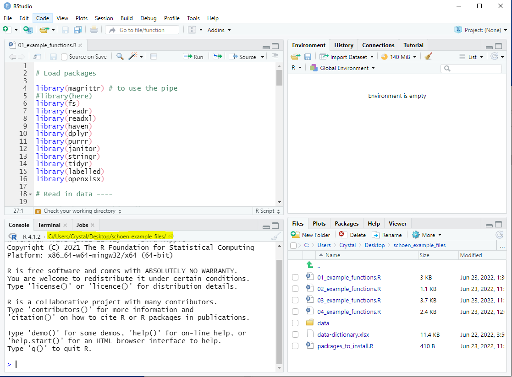
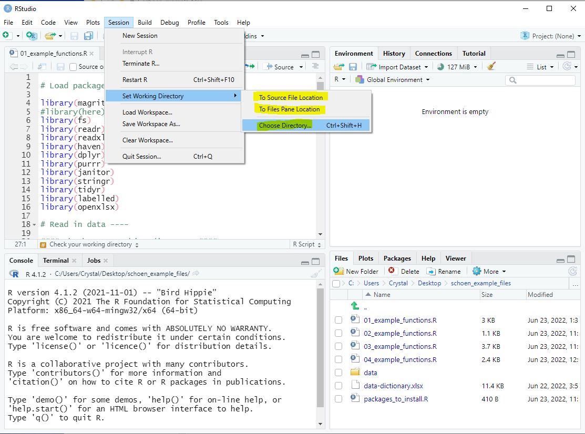
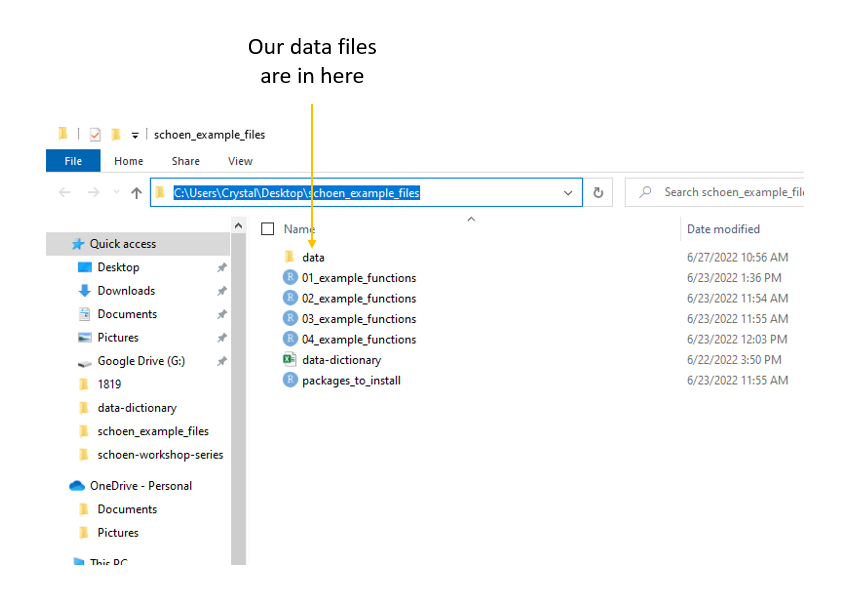

```{r setup, include=FALSE}
options(htmltools.dir.version = FALSE)
knitr::opts_chunk$set(
  fig.width=9, fig.height=3.5, fig.retina=3,
  out.width = "100%",
  cache = FALSE,
  echo = TRUE,
  message = FALSE, 
  warning = FALSE,
  hiline = TRUE,
  comment = NA
)

xaringanExtra::use_tile_view()
xaringanExtra::use_panelset()

```


```{r xaringan-themer, include=FALSE, warning=FALSE}

library(xaringanthemer)

style_duo_accent(
  secondary_color = "#782F40",
  primary_color = "black", 
  background_color = "#CEB888",
  code_inline_color = "black",
)
```


class: inverse, left, middle

background-image: url(img/cover2.png)

# Data Management Overview: Session 5
## Training for Schoen Research

----

## Crystal Lewis

Slides available on [`r fontawesome::fa("github", fill = "white")`](https://cghlewis.github.io/schoen-data-mgmt-series-public/)

---

# Plan for this series

.pull-left[

Session 3
* ~~Why R?~~
* ~~Getting acclimated with R and RStudio~~
* ~~Understanding objects, functions, and packages~~
* ~~Code writing best practices~~

Session 4
* ~~Packages and functions for data wrangling~~
]

.pull-right[

Session 5
* Packages and functions for data wrangling cont.
* Setting up a reproducible syntax file
* Cleaning and validating data with R

Session 6
* Additional data wrangling with R

```{r, echo = FALSE, out.width = "300px", fig.align='center'}
knitr::include_graphics("img/r-project.svg")
```
]


---

# Recap Tidy Evaluation

.center[Most of the functions we are learning come from the Tidyverse (an opinionated collection of packages)

One great reason to use the Tidyverse is that most of the functions use **Tidy Evaluation**

Tidy evaluation allows us to simplify the way we grab and manipulate variables/vectors within datasets]

<br>

.pull-left[

Tidy Evaluation: Select variables

```{r, eval = FALSE}

select(sch_data, test_score, grade_level)

```

]

.pull-right[
Base R: Select variables

```{r, eval = FALSE}

sch_data[ , c("test_score", "grade_level")]

```
]


---

# Recap Pipe Operator

The pipe, **%>%**, which comes from the `magrittr` package, allows us to forward an object or a result of a function, into the next function

.pull-left[

Without the pipe: 
  + More steps
  + The data frame is called multiple times
  + Have to create multiple objects

```{r, eval = FALSE}

sch_data2 <- select(sch_data, id, test_score)

sch_data_final <- filter(sch_data2, 
                    test_score > 300)

```


]

.pull-right[

With the pipe: 
  + Less steps
  + The data frame is only called once
  + The data frame is pulled out the function and becomes the first step in the process
  + Only need to create one object

```{r, eval = FALSE}

sch_data_final <- sch_data %>%
  select(id, test_score) %>%
  filter(test_score > 300)

```

]


---

# Recap Reading in Data

Read in a csv

```{r, eval = FALSE}

read_csv(
  file = #<<
    "file_name.csv")

```


Read in an xlsx

```{r, eval = FALSE}

read_excel(
  path = #<<
    "file_name.xlsx")

```

Read in an sav


```{r, eval = FALSE}

read_sav(
  file = #<<
    "file_name.sav")

```


---

# Naming Arguments

It is a good practice to name arguments, especially as beginners, but many times we don't need to name our first argument

.pull-left[


]

.pull-right[

Before:

```{r, eval = FALSE}

read_csv(file = "file_name.csv", 
         col_names = FALSE, skip = 2)

```

With the **file = ** removed:

```{r, eval = FALSE}

read_csv("file_name.csv", 
         col_names = FALSE, skip = 2)

```

]


---

# Recap Working Directory

.center[**What is a working directory?**]

.center[Default location where R will look for files you want to load and where it will put any files you save or export. You usually want this to be your top folder level (ex: schoen_example_files)].


.center[**How can we check our working directory?**]

.pull-left[



]

.pull-right[

```{r, eval = FALSE}

getwd()

```

`"C:/Users/Crystal/Desktop/schoen_example_files"`

]


---

# Recap Changing your Working Directory

.pull-left[

**Option 1:**

Use `setwd()` function to change your working directory

Reminders:
  + You cannot use `\` in R. They will need to be changed to `/`
  + The path must be in ""

```{r, eval = FALSE}

setwd("C:/Users/Crystal/Desktop/
      schoen_example_files")

```

]

.pull-right[

**Option 2:**


]


---

class: center, inverse

# Recap Navigating to your data files

AWESOME! `r emo::ji("star")` We are in the correct working directory now (our top level folder).

But what if our data is not in the same folder as our working directory?

```{r, echo = FALSE, out.width = "600px", fig.align = "center"}


```


---

# Recap Absolute vs Relative Paths

.pull-left[

**Option 1: Absolute full file path**

Issues:
  + You will need to change all `\` to `/` 
  + If other people use your syntax, they will need to change this file path

```{r, eval = FALSE}

svy_csv <- read_csv(
  "C:/Users/Crystal/Desktop/
  schoen_example_files/data/tch_survey.csv")

```

On Windows: Right click on file -> Properties -> Security -> Object name

]

.pull-right[

**Option 2: Relative file path**

Last week we learned about the `path` function from the `fs` package
  + You build paths starting at your current working directory, then add any folders or files below that
  + `.` means your current working directory
  + `..` means go back one level from your current working directory

```{r, eval = FALSE}

svy_csv <- read_csv(
  path(".", "data","tch_survey.csv"))

```

]


---

# Recap Functions

.pull-left[

**Read in data**

|Task | Package | Function |
|-----|---------|----------|
|read in csv file | readr | read_csv |
|read in xlsx file | readxl | read_excel |
|read in sav file | haven | read_sav |

**Set relative path**

|Task | Package | Function |
|-----|---------|----------|
|check working directory | base | getwd |
|set relative path | fs | path |

]

.pull-right[

**Rename variables**

|Task | Package | Function |
|---------|-----------|-----------|
|rename variables | dplyr | rename |
|rename all variables | purrr | set_names|
|modify variable names | dplyr | rename_with |

**Review data**

|Task | Package | Function |
|-----|---------|----------|
|review data structure | base |str|
|transposed printed data | dplyr | glimpse |
|summarize data | base | summary |
|table variables | janitor | tabyl|

]


---

# Name variables

.panelset[
.panel[.panel-name[rename]

Formula is `new name = old name`

```{r, eval = FALSE}

data %>%
  rename(new_name = old_name)

```

If the old name has spaces in it, you need to surround the name in backticks ` `

```{r, eval = FALSE}

data %>%
  rename(tch_gender = x1, tch_race = `teacher race`)

```


]

.panel[.panel-name[set_names]


The number of names must equal the number of variables in the data frame, in the same order

Names must be in ""

```{r, eval = FALSE}

data %>%
  set_names("new_name1", "new_name2", "new_name3")


```
]

.panel[.panel-name[rename_with]

.pull-left[

```{r, eval = FALSE}

data %>% 
  rename_with(~ function, variables)

```

* `~` = as a function of

* function = any function you want to use to rename your variables

* variables = any variables you want to rename with your function

]

.pull-right[
A common function to include is `paste0` which is a base function

This transformation below would add `_1819` to the end of variable names

The `.` means paste my variable name **first**, then add my string.

```{r, eval = FALSE}

data %>% 
  rename_with(~ paste0(., "_1819"), 
              c(variable1, variable2))

```

]
]
]


---

# Review Data

Data

.panelset[
.panel[.panel-name[str]

```{r, eval = FALSE}

data %>%
  str()

```

```{r, echo = FALSE}

library(tidyverse)

svy <- tibble::tribble (~`SurveyDate`, ~id, ~consent, ~dist_sch_name, ~degree,~ `yrs teach`,
                         "2022-05-15", 1234, 1, "Kirkwood - Nipher Middle School", 1, "5 yrs",
                         "2022-05-15", 1234, NA,"", NA, "",
                         "2022-05-16", 1235, 1, "Webster - Webster Groves High School", 2, "4",
                         "2022-05-17", 1236, 1, "Kirkwood - Nipher Middle", 6, "1 year",
                         "2022-05-17", 1237, 2, "" , NA, "")

svy %>%
  purrr::set_names("start_date", "tch_id", "consent", "dist_sch_name", "degree", "yrs_teach") %>%
  str()

```

]
.panel[.panel-name[glimpse]

```{r, eval = FALSE}

data %>%
  glimpse()

```

```{r, echo = FALSE}

svy %>%
  purrr::set_names("start_date", "tch_id", "consent", "dist_sch_name", "degree", "yrs_teach") %>%
  glimpse()

```

]

.panel[.panel-name[summary]

.pull-left[
```{r, eval = FALSE}

data %>%
  summary()

```
]

.pull-right[
```{r, echo = FALSE}

svy %>%
  purrr::set_names("start_date", "tch_id", "consent", "dist_sch_name", "degree", "yrs_teach") %>%
  summary()

```

]
]

.panel[.panel-name[tabyl]

.pull-left[
```{r, eval = FALSE}

data %>%
  tabyl(variable name)

```

```{r, echo = FALSE}

svy %>%
  purrr::set_names("start_date", "tch_id", "consent", "dist_sch_name", "degree", "yrs_teach") %>%
  janitor::tabyl(degree)

```

]

.pull-right[

```{r, eval = FALSE}

data %>%
  tabyl(variable1, variable2)

```

```{r, echo = FALSE}

svy %>%
  purrr::set_names("start_date", "tch_id", "consent", "dist_sch_name", "degree", "yrs_teach") %>%
  janitor::tabyl(dist_sch_name, degree)

```

]
]
]

---

class: center, middle

# `r fontawesome::fa("question", fill = "#782F40")` Let's Practice This Again `r fontawesome::fa("question", fill = "#782F40")`

---

# Recap Functions

.pull-left[

**Find and remove duplicates**

|Task | Package | Function |
|-----|---------|----------|
|find duplicates| janitor | get_dupes |
|remove duplicates | dplyr | distinct |

**Filter data**

|Task | Package | Function |
|-----|---------|----------|
|filter rows of data | dplyr | filter |

]

.pull-right[

**Select variables**

|Task | Package | Function |
|-----|---------|----------|
|select variables | dplyr | select |

**Create new variables**

|Task | Package | Function |
|-----|---------|----------|
|create new variable|dplyr | mutate|
]

---

# Remove duplicates

.panelset[
.panel[.panel-name[find-duplicates]

An example identifier variable would be a student or teacher id

```{r, eval = FALSE}

data %>%
  get_dupes(identifier variable/s)

```

```{r, echo = FALSE}

svy %>%
  purrr::set_names("start_date", "tch_id", "consent", "dist_sch_name", "degree", "yrs_teach") %>%
  janitor::get_dupes(tch_id)

```

]

.panel[.panel-name[remove-duplicates]

.pull-left[

```{r, eval = FALSE}

data %>%
  distinct(identifier variable/s, 
           .keep_all = TRUE)

```

* .keep_all = TRUE means that I want to keep all of my variables in the data

Using distinct will keep the first instance and drop all remaining duplicates. 

Depending on how your data is organized, this may not be what you want.
]

.pull-right[

Consider using the `arrange` function from the `dplyr` package to arrange the data how you want before dropping the duplicates

For example, if date was collected, you may want to arrange by descending date to keep the most recent case 

```{r, eval = FALSE}

data %>%
  arrange(tch_id, desc(date)) %>%
  distinct(tch_id, .keep_all = TRUE)

```
]
]
]


---

# Filter data

.panelset[
.panel[.panel-name[filter-operators]

.pull-left[
Filtering/Comparison operators include 
 - `>`
 - `<`
 - `>=`
 - `<=`
 - `==`
 - `!` or `!=`
 - `%in%`
 - `between`
]

.pull-right[
Logical operators used to filter on multiple columns:

|Operator|Meaning          |
|--------|-----------------|
| &#124;   | AND/OR          |
|  &     | AND             |
| ,      | AND             |
| xor    | OR (not both)   |
]
]

.panel[.panel-name[filter-numeric]

.pull-left[


```{r, eval = FALSE}

data %>%
  filter(logical expression)

```
]

.pull-right[
Here you would use a variable in your data and a comparison operator

```{r, eval = FALSE}

data %>%
  filter(numeric variable == 1)

```

```{r, eval = FALSE}

data %>%
  filter(numeric variable >= 50)

```
]

]

.panel[.panel-name[filter-character]

.pull-left[
I can also filter on non-numeric variables

```{r, eval = FALSE}

data %>%
  filter(logical expression)

```
]

.pull-right[

```{r, eval = FALSE}

data %>%
  filter(character variable == "some string")

```

```{r, eval = FALSE}

data %>%
  filter(character variable %in% 
           c("some string", 
             "some other string"))

```

]
]

.panel[.panel-name[filter-na]

I can filter based on NA values

The function `is.na` is a base function that returns either TRUE or FALSE which the filter function uses to determine who to filter on

```{r, eval = FALSE}

data %>%
  filter(!is.na(variable))

```

]

.panel[.panel-name[filter-multiple-vars]

I can also filter using multiple variables

```{r, eval = FALSE}

data %>%
  filter(variable1 == 1 & variable2 == 5)

```

```{r, eval = FALSE}

data %>%
  filter(variable1 == "some text" | variable2 == "other text")

```

]
]


---

# Select Variables

.panelset[
.panel[.panel-name[select-to-keep]

You can either select the variables you want to keep 

```{r, eval = FALSE}

data %>%
  select(variable1:variable3)

```

```{r, eval = FALSE}

data %>%
select(variable1, variable2, variable3)

```


]

.panel[.panel-name[select-to-remove]

Or select the variables you want to remove (using "-")

```{r, eval = FALSE}

data %>%
  select(-variable4)

```

```{r, eval = FALSE}

data %>%
  select(-c(variable4, variable5, variable6))

```

]

.panel[.panel-name[select-with-tidy-select]

You can also select variables using selection helpers.

These include: `starts_with`, `ends_with`, and `contains`.

```{r, eval = FALSE}

data %>%
  select(contains("bmtl"))

```

```{r, eval = FALSE}

data %>%
  select(ends_with("_1819"))

```

]
]


---

# Create new variables

.pull-left[

Any time you want to create a new variable within a data frame, you use `mutate`

This may be creating an entirely new variable or it may be recalculating, transforming, or recoding an existing variable

```{r, eval = FALSE}

data %>%
  mutate(new variable name = 
           a constant or some expression)

```

* `new variable name` = this can either be a completely new name, or you can use an existing name and write over the existing variable

]

.pull-right[

```{r, eval = FALSE}

data %>%
  mutate(cohort = 1)

```

```{r, eval = FALSE}

data %>%
  mutate(age_months = age_years*12)

```

```{r, eval = FALSE}

data %>%
  mutate(sch_name = recode(
    sch_name, 
    `nipher middle school` = "Nipher Middle"))
  ))
```
]


---

class: center, middle

# `r fontawesome::fa("question", fill = "#782F40")` Let's Practice This Again `r fontawesome::fa("question", fill = "#782F40")`

---

# Recap Functions

.pull-left[

**Edit strings in variables**

|Task | Package | Function |
|-----|---------|----------|
|remove strings | stringr | str_remove_all |
|replace strings | stringr | str_replace_all |

**Change class**

|Task | Package | Function |
|-----|---------|----------|
|change to numeric | base | as.numeric |
|change to character| base | as.characater|
|change to date|lubridate|several functions|

]

.pull-right[

**Split variables**

|Task | Package | Function |
|-----|---------|----------|
|separate into more than one variable | tidyr | separate |

**Recode variables**

|Task | Package | Function |
|-----|---------|----------|
|recode a variable|dplyr | recode|
|conditional function to regroup/recode a variable|dplyr|case_when|
|conditional function to regroup/recode a variable|dplyr|if_else
]


---

# Edit Strings in Variables

.panelset[
.panel[.panel-name[str_remove]

.pull-left[

This function is used to remove strings in variables

```{r, eval = FALSE}

data %>%
  mutate(new variable name = 
           str_remove_all(variable, 
                          pattern))

```

* variable = the variable that has the string/s we want to remove
* pattern = any pattern you want removed from a variable (could be words, symbols, or numbers)

]

.pull-right[

The pattern must be in quotes

```{r, eval = FALSE}

data %>%
  mutate(variable1 = 
           str_remove_all(
             variable1, pattern = "$"))

```

]
]

.panel[.panel-name[str_replace]

.pull-left[
This function is used to replace strings in variables

```{r, eval = FALSE}

data %>%
  mutate(new variable name = 
           str_replace_all(
             variable, pattern, 
             replacement))

```

* variable = the variable that has the string/s we want to replace

* pattern = any pattern you want to replace in a variable

* replacement = what you want to replace the pattern with
]

.pull-right[

The pattern and replacement must be in quotes

```{r, eval = FALSE}

data %>%
  mutate(variable1 = 
           str_replace_all(
             variable1, pattern = "yr",
             replacement = "YEAR"))

```

]
]
]

---

# Change class

.panelset[
.panel[.panel-name[class-numeric]

```{r, eval = FALSE}

data %>%
  mutate(new variable = as.numeric(character variable))

```

Note: If your character variable still has character values in it (letters, symbols, spaces), those values will be coded to NA when you change the class to numeric. You should deal with those values before recoding to numeric.

]

.panel[.panel-name[class-character]


```{r, eval = FALSE}

data %>%
  mutate(new variable = as.character(numeric variable))

```

]

.panel[.panel-name[class-date]

.pull-left[

`lubridate` has many functions to deal with character variables whose class needs to be date. 

A few of those include:

`mdy()` : The character variable is in the format of month-day-year

`ymd()` : The character variable is in the format of year-month-day

`dmy()` : The character variable is in the format of day-month-year
]

```{r, eval = FALSE}

data %>%
  mutate(new variable = function(character date))

```

If our character date variable had values like "03-22-2022" then we could use `mdy()`

```{r, eval = FALSE}

data %>%
  mutate(date = mdy(date))

```

```{r, echo = FALSE}

tibble::tribble(~date, "03-22-2022", "04-15-2022") %>%
  mutate(date = lubridate::mdy(date))

```

]
]


---

# Split Variables

.pull-left[
Sometimes a variable contains more than one piece of information and needs to be split into 2 or more variables

```{r, eval = FALSE}

data %>%
  separate(variable, 
           into,
           sep)

```

* into = what will the new variable names be after your variable is split

* sep = what separates the pieces of information

The default is to remove the input column after separating. If you do not want this, you can add the argument `remove = FALSE`
]

.pull-right[
```{r, eval = FALSE}

data %>%
  separate(city_state,
           into = c("city", "state"),
           sep = ",")

```

]


---

# Recode Variables

.panelset[
.panel[.panel-name[recode]

.pull-left[
The formula for `recode` is `old value = new value`

The old value is a named value. If it is a number it needs to be surrounded in backticks.

Any value you do not recode will be copied over as is.
```{r, eval = FALSE}

data %>%
  mutate(new variable = 
           recode(variable, 
                  old value = new value))

```
]

.pull-right[

```{r, eval = FALSE}

data %>%
  mutate(variable1_r = 
           recode(variable1, `2` = 0))

```

```{r, eval = FALSE}

data %>%
  mutate(variable2 = recode(variable2, 
                            f = "free",
                            r = "reduced"))

```

]
]
.panel[.panel-name[case_when]

.pull-left[

```{r, eval = FALSE}

data %>%
  mutate(new variable =
           case_when(
             condition ~ value,
             TRUE ~ value
           ))

```

* condition = a logical condition, usually comparing a variable to a value or another variable

* `~` = "then replace with" 

* value = character, numeric, NA, date value, or an existing variable

* `TRUE` = "if it doesn't meet the criteria already given then"

]

.pull-right[
```{r, eval = FALSE}

data %>%
  mutate(school_name =
    case_when(
      school_name == 
        "sch a" ~ 
        "School A", 
      school_name == 
        "schoola" ~
        "School A",
      TRUE ~ school_name
    )
  )

```

]
]

.panel[.panel-name[if_else]

.pull-left[

```{r, eval = FALSE}

data %>%
  mutate(new variable = 
           if_else(condition, true, false))
```

* condition = a logical condition, usually comparing a variable to a value or another variable

* true = if the condition is true, use this value

* false = if the condition is false, use this value

]

.pull-right[

```{r, eval = FALSE}

data %>%
  mutate(collapsed_variable = 
           if_else(variable == 5, 0, 1))

```

]
]
]


---

class: center, middle

# `r fontawesome::fa("question", fill = "#782F40")` Let's Practice `r fontawesome::fa("question", fill = "#782F40")`

---

# Functions for Data Cleaning

.pull-left[

**Recode NAs**

|Task | Package | Function |
|-----|---------|----------|
|recode to NA | dplyr | na_if |
|recode NA to a value | tidyr | replace_na |

**Add value labels**

|Task | Package | Function |
|-----|---------|----------|
|add value labels | labelled | set_value_labels |
|review value labels| labelled | val_labels|
|add labelled missing values|labelled|set_na_values|
|review missing value labels | labelled | na_values|

]

.pull-right[

**Add variable labels**

|Task | Package | Function |
|-----|---------|----------|
|add variable labels | labelled | set_variable_labels|
|review variable labels | labelled | var_label |

**Export data**

|Task | Package | Function |
|-----|---------|----------|
|export csv | readr | write_csv|
|export xlsx| openxlsx|write.xlsx|
|export sav | haven | write_sav

]


---


# Recode NA

.panelset[
.panel[.panel-name[recode-to-na]

.pull-left[
```{r, eval = FALSE}

data %>%
  na_if(value)

```

* value = the value you want to replace with NA

This function as is will apply to the entire data frame
]

.pull-right[
If you want to only apply this to certain variables, then you need to use the `across` function from `dplyr` to select variables

```{r, eval = FALSE}

data %>%
  mutate(across(c(variable1, variable2,
                  variable3),  
                ~na_if(., -999)))

```

* `~` = as a function of
* `.` = refer to the variables referenced earlier for where to replace with NAs


]
]

.panel[.panel-name[replace-na]

.pull-left[
```{r, eval = FALSE}

data %>% 
  mutate(variable = replace_na(
    variable, value))

```

<br>

```{r, eval = FALSE}

data %>%
  mutate(iss = replace_na(iss, 0))

```

]

.pull-right[

You can also replace NA values for multiple variables using the function `across` from the `dplyr` package.

```{r, eval = FALSE}

data %>% 
  mutate(across(variable1:variable10, 
                ~ replace_na(., -999)))

```

* `~` = as a function of

* `.` = refer to the variables referenced earlier for where to replace the NAs

]
]
]


---

# Add Value Labels

.panelset[
.panel[.panel-name[add-value-labels]

.pull-left[
Value labels are helpful if you are exporting to a software that can support them, such as SPSS

```{r, eval = FALSE}

data %>% 
  set_value_labels(
  variable = c("label1" = value, 
               "label2" = value))

```

```{r, eval = FALSE}

data %>%
  set_value_labels(
    q1 = c( "no" = 0, "yes" = 1),
    q2 = c("no" = 0, "yes" = 1)
  )
```

```{r, echo = FALSE}

library(labelled)

data <- tibble::tribble(~q1, ~q2,
                0, 1,
                1, 0) %>%
  labelled::set_value_labels(q1 = c("no" = 0, "yes" = 1),
                             q2 = c("no"= 0, "yes" = 1))

```
]

.pull-right[
You can review your value labels

```{r}

data %>% 
  val_labels()

```
]
]

.panel[.panel-name[set-missing-values]

.pull-left[
Setting missing values are helpful if you are exporting to a program that can support them, like SPSS

If you have missing values like -99 or -98, those will not be recognized as missing values in programs like SPSS unless you label them as missing values before exporting

Be aware that R will not consider your labelled missing values as NA when conducting calculations

```{r, eval = FALSE}

data %>% 
  set_na_values(Variable = value)

```
]

.pull-right[

You can have one or more values labelled as missing

```{r, eval = FALSE}

data %>%
  set_na_values(variable1 = c(-97, -98))

```


You can review your missing value labels

```{r, echo = FALSE}

data <- tibble::tribble(~variable1, ~variable2,
                250, 300,
                -97, 220) %>%
  set_na_values(variable1 = c(-97, -98))

```

```{r}

data %>%
  na_values()

```

]
]
]


---

# Add Variable Labels

Variable labels can be very helpful if you are exporting your data to a program that supports them, like SPSS

```{r, eval = FALSE}

data %>%
  set_variable_labels(variable = "label")

```

You can review variable labels

```{r, echo = FALSE}
data <- tibble::tribble(~variable1, ~variable2,
                250, 300,
                -97, 220) %>%
  set_variable_labels(variable1 = "Why does my dog stare at me?", variable2 = "Is my dog happy?")

```


```{r}

data %>%
  var_label()
```

---

# Export Data

.panelset[
.panel[.panel-name[export-csv]

```{r, eval = FALSE}

write_csv(object, file)

```

* object name = the final data frame or tibble to be exported

* file = the path to write the file to (which includes the name and extension of your file)

Same as when we imported data, if you are not exporting your file to your working directory, you will need to include your path in the file argument.

Notice I am using the `path` function from the `fs` package again to create a relative path to where I want to export my data

```{r, eval = FALSE}

write_csv(data, path(".", "data", "my-data-clean.csv"))
```

]


.panel[.panel-name[export-xlsx]

```{r, eval = FALSE}

write.xlsx(object, file)

```

* object name = the final data frame or tibble to be exported

* file = the path to write the file to (which includes the name and extension of your file)

Same as when we imported data, if you are not exporting your file to your working directory, you will need to include your path in the file argument.

Notice I am using the `path` function from the `fs` package again to create a relative path to where I want to export my data


```{r, eval = FALSE}

write.xlsx(data, path(".", "data", "my-data-clean.xlsx"))
```

]
.panel[.panel-name[export-sav]

```{r, eval = FALSE}

write_sav(object, path)

```

* object name = the final data frame or tibble to be exported

* path = the path to write the file to (which includes the name and extension of your file)

Same as when we imported data, if you are not exporting your file to your working directory, you will need to include your path in the "path" argument.

Notice I am using the `path` function from the `fs` package again to create a relative path to where I want to export my data

```{r, eval = FALSE}

write_sav(data, path(".", "data", "my-data-clean.sav"))
```

Bonus: When you export labelled data to SPSS using `write_sav` it will export your variable and value labels as well as your missing values into the file

]
]

---

class: center, middle

# `r fontawesome::fa("question", fill = "#782F40")` Let's Practice `r fontawesome::fa("question", fill = "#782F40")`

---

# Reproducible Data Cleaning Workflow

.pull-left[

**Preliminary Steps before Syntax Creation:**

1. Have your data cleaning plan ready

1. Review any ReadMe files
  + Incorporate into data cleaning plan

1. Have your data dictionary ready

1. Set up a consistent folder structure according to your Style Guide

1. Name your files consistently and according to your Style Guide


]

.pull-right[

**Tips for a Reproducible Syntax File:**

1. Use comments to organize and communicate each step of your data cleaning plan
2. Put all cleaning steps into syntax
3. Use relative file paths to import and export data
  - Don't set your working directory in your syntax
  - Consider using R projects to set your working directory
4. Don't do anything random in your syntax
  - Set seeds for random number generation
  - Order your data before removing duplicates
5. Record Session Info
  + Operating system info
  + R Version info
  + Package versions

]


---

# Creating Reliable and Automated Workflows

.pull-left[

**Reliable practices:**

1. Review your data upon import

1. Check each transformation
  - Review the data before and after

2. Validate your data before exporting
  
3. Versioning and keeping change logs
  - Data
  - Code

]

.pull-right[

**Automation practices:**

1. Integrate your data dictionary into your syntax

2. Writing functions for repeatable tasks

3. Package up useful functions

4. Using Makefiles to execute multiple files

5. Making documentation using code

]


---

# Setting up your Syntax File Basics

```{r, eval = FALSE}

1. Add your libraries

2. Check your working directory

3. Change your working directory if needed (in console or drop-down)

4. Import data using relative paths
  - Check your data

5. For each step of your data cleaning plan
  - Comment
  - Code
  - Check

6. Validate data

7. Export data using relative paths

8. Write out a Session Info file

```


---

.pull-left[
```{r, eval = FALSE}

library(magrittr)
library(fs)
library(readr)
library(dplyr)
library(janitor)

# Check working directory 

getwd()

# (01) Read in data ----

tch_svy <- read_csv(
  path(".", "data", "tch_survey_raw.csv"))

# Check: Review your data

str(tch_svy)

# (02) Identify duplicates ----

tch_svy %>%
  get_dupes(tch_id) # No duplicates found

# (03) Remove identifier variables ----

# Check: What variables do I have?

names(tch_svy)


```
]

.pull-right[
```{r, eval = FALSE}

# Drop variables

tch_svy <- tch_svy %>%
  select(-first_name, -last_name)

# Check: What variables do I have now?

names(tch_svy)

# (04) Data Validation ----

# Various checks

# (05) Export data to a csv ----

write_csv(tch_svy, 
      path("data", "tch_survey_clean.csv"))


# Print out Session Info ----

sessionInfo() %>%
  capture.output(
    file = "tch_survey_sessionInfo.txt")

```
]


---

background-image: url(img/session_info.PNG)


---

# Data Cleaning Plan

.pull-left[

1. Import the SPSS file into R **

1. Rename variables based on our data dictionary **

1. Remove any participant who did not **consent** **

1. Check for duplicates

1. Recode **degree** `( 6 -> 0)` **

1. Remove strings from **yrs_teach** and make it a numeric variable

]

.pull-right[

7\. Convert **tch_id** to a character variable

8\. Remove identifier variables (**survey_date**)

9\. Add variable labels for **degree** and **yrs_teach**

10\. Add value labels for **degree** **

11\. Validate data

12\. Export data to SPSS **
]


---

class: center, middle

# `r fontawesome::fa("question", fill = "#782F40")` Let's Practice `r fontawesome::fa("question", fill = "#782F40")`

---

class: inverse, center, middle

# Questions?

